# Architecture Views — Core Banking Product Engine

> **Status: DRAFT.** Architecture views of the engine described in [01 — Product Architecture](./01-product-architecture.md): a **C4 model** (System Context · Container · Component) for *structure*, plus a set of **behaviour & data views** (sequence, state-machine, ER, choreography, data-flow) for the temporal, lifecycle, and persistence stories that a structural model cannot carry. Class diagrams are deliberately excluded (the engine's domain types are specified in the event contract [02 §2.4](./02-v1-scope-term-deposits.md), the `events`-table contract [ADR-PC-001 §P1](./adrs/ADR-PC-001-event-store-technology.md), and the family lifecycle tables in code; a UML class layer would duplicate them and rot).
>
> This document is a **view onto decisions already made**, not a new decision. Every box and line traces to a concept doc, a feature-design note, or an ADR; where it does, the source is cited. If this view and a cited source disagree, the source wins and this document is the bug.
>
> *Last reconciled against the ADR corpus on 2026-06-26 (ceiling ADR-IC-019 / ADR-PC-034).* When a later ADR moves the architecture, this line and the affected view are the first things to update.

---

## How to read this document

[C4](https://c4model.com) describes software *structure* with a hierarchy of diagrams at four levels of zoom. This document uses the top three for structure, then adds behaviour & data views for what structure cannot show:

| View | Question it answers | Audience |
|---|---|---|
| **C4 L1 — System Context** | How does the engine fit into the bank's estate? Who uses it; which systems does it exchange with? | Everyone — including non-technical stakeholders |
| **C4 L2 — Container** | What are the separately-deployable/runnable pieces *inside* the engine's world, and what shared integration-estate runtimes does it plug into? | Engineers, ops |
| **C4 L3 — Component** | What are the major code-level building blocks inside a single container? | Engineers working in the codebase |
| ~~C4 L4 — Code/Class~~ | *(omitted — see header)* | — |
| **Behaviour & data views** | In what *order* do steps happen; what are the *legal* lifecycle transitions; what does the *persistence* actually look like? | Engineers working in the codebase |

### Two notations, by intent

The structural and behavioural views use **two different diagram tools, chosen by what GitHub can render**:

- **C4 structure → PlantUML** ([C4-PlantUML](https://github.com/plantuml-stdlib/C4-PlantUML) macros). **GitHub does not render PlantUML**, so each C4 diagram is **pre-rendered to SVG and committed** next to its `.puml` source, and the Markdown embeds that SVG.
- **Behaviour & data → [Mermaid](https://mermaid.js.org)**. GitHub **renders Mermaid natively**, so the sequence/state/ER/flow diagrams below live **inline** in this file as fenced ` ```mermaid ` blocks — no build step, and the source *is* the diagram. (Other text-to-diagram tools — D2, for instance — render beautifully but carry the same pre-render-and-commit tax as PlantUML; D3.js is a browser visualisation library, not a diffable diagram source. Mermaid is the only one that crosses the GitHub-native-render line, which is decisive for diagrams that must stay reviewable in a PR.)

The rule in one line: **structure in C4-PlantUML, behaviour in Mermaid.** For the PlantUML half:

- **Source of truth** is a `.puml` file under [`diagrams/`](./diagrams). The include uses the PlantUML standard-library short form (`!include <C4/...>`); a commented remote-include fallback is kept in each `.puml` for renderers lacking the bundled stdlib.
- **Committed artefact** is the rendered `.svg` beside it. Regenerate after any edit:
  ```bash
  plantuml -tsvg docs/product-management/product_concepts/diagrams/*.puml
  ```
- **Prerequisites** (one-time): a JDK, Graphviz (`dot`), and PlantUML. Full setup in [`INSTALL.md`](../../../INSTALL.md) — e.g. `brew install graphviz plantuml`.

The SVG is rendered output, never hand-edited; if an SVG and its `.puml` disagree, re-render. Drift between the two is guarded by the [`.githooks/pre-commit`](../../../.githooks/pre-commit) hook, which re-renders any staged `.puml` and stages the resulting SVG.

### The system-boundary decision (load-bearing)

The brief is explicit that the engine does **not** redesign the integration backbone — broker, gateway, anti-corruption layer, saga orchestrator, MCP server, observability — its architecture is fixed in [integration_concepts/adrs/](../integration_concepts/adrs/README.md) ([01 §6](./01-product-architecture.md)). That is a statement about **design authority**, not **build provenance**: several estate components are nonetheless *built in-house* (the saga orchestrator, the outbox, the ACL, the MCP server, the notification service) and co-located in the monorepo per [ADR-IC-013](../integration_concepts/adrs/ADR-IC-013-in-house-estate-build-and-repository-placement.md), while others (broker, gateway, observability) are consumed third-party images. The C4 model honours the *role* split:

- **L1 (Context)** draws the engine as the single system in focus and the bank's other systems as external neighbours. The shared transport (Redpanda, Kong, the ACL service) is intentionally **not** drawn here — at context level we care *which systems exchange what*, not *through which pipe*.
- **L2 (Container)** is where the surrounding estate appears, tagged as integration-estate runtimes (distinct shading), so the seam between the product engine and the estate is visible.

"External system" in C4 is **not** a synonym for "out of scope". Per [00 §4](./00-product-vision.md), GL / IFRS 9 / channels / payments / fraud / KYC are out-of-scope *products*, but the integration *to* them is the in-scope, load-bearing asset of the build ([00 §1.5](./00-product-vision.md)). C4 captures exactly this: those products are `System_Ext` (grey) neighbours; the **relationships** crossing the boundary are the asset this view documents.

---

## The separation model — three planes (the spine)

Everything below reads against one organising idea, so it is stated **once** here and reused at every level: babelstone is a **generic substrate that knows no product**, into which **per-family plugins** are loaded, driven by **declarative data**. The whole architecture is the disciplined maintenance of that split — and, crucially, the split is **not engine-only**: the same "family-agnostic core + family-owned plugin" shape now governs the **engine**, the **saga orchestrator**, and the **notification platform** alike.

| Plane | What it is | Where it lives | Knows a product? |
|---|---|---|---|
| **① Generic substrate** (family-agnostic) | The engine event-sourcing core (`AggregateRuntime`, append/load, command ingress, parameter/rate resolvers, the `Money` boundary, the PII envelope, the financial-math kernel, the outbox/inbox); the **orchestrator saga substrate** (the table-driven state-machine runtime, saga stores, the `ISagaModule` seam); the **notification scheduler core** (poll loop, dedupe ledger, composite-id); plus the consumed estate (Kong, Redpanda+SR, the ACL, observability). | `engine/` core projects, `orchestrator/src/Babelstone.Orchestrator.Substrate/`, `notification/src/Babelstone.Notification/`, estate runtimes | **No.** A build-time fitness function fails if it ever names a family. |
| **② Family-owned plugins** (gold) | Per family: the **event records + pure fold handlers**, the **decider** (the impure application layer — [ADR-PC-021](./adrs/ADR-PC-021-application-layer-family-owned-deciders.md)), the **projections**, the **lifecycle legality table**, the **saga module** (e.g. constitution/renewal — [ADR-IC-018](../integration_concepts/adrs/ADR-IC-018-family-owned-saga-modules.md)), and the **notification scheduling rules** ([ADR-IC-019](../integration_concepts/adrs/ADR-IC-019-family-agnostic-notification-platform.md)). | `families/term-deposit/`, `families/personal-loan/` (subtrees under each runtime: `…`, `….Application`, `….Orchestration`) | **Yes** — and *only* these do. |
| **③ Declarative data** | The **pack** (signed YAML primitives/parameters + `.cue` schemas), **variant config**, and **rate sheets**. No executable code. | OCI registry (pack), `product-configs/`, rate-sheet store | It *is* the product parameters — but as data, not code. |

**The dependency arrow always points family → substrate, never back.** Adding a product means dropping in a family plugin (and its declarative data); it must produce **zero diff** in the generic substrate. Three runtimes now enforce this, each with the same mechanism — an explicit module seam plus a fitness function:

- **Engine:** `EngineFamilyAgnosticTests` fails if the core references `families/**`; family handlers are pure (no clock/I/O/randomness), enforced by the **BENG001/002/003** Roslyn analysers ([event-store §3, §5.3](./feature-design-event-store-projections.md), [ADR-PC-021](./adrs/ADR-PC-021-application-layer-family-owned-deciders.md)).
- **Orchestrator:** the substrate carries no `families/**` reference; a concrete saga (`ConstitutionProcess`) lives in its family module, never in the substrate, enforced by a sibling fitness test ([ADR-IC-018 §P1/§P2](../integration_concepts/adrs/ADR-IC-018-family-owned-saga-modules.md)).
- **Notification:** the scheduler core names no family; each family registers its reminder rule through `IFamilyNotificationModule` ([ADR-IC-019 §D2/§D4](../integration_concepts/adrs/ADR-IC-019-family-agnostic-notification-platform.md)).

**The colour legend, defined once and reused by every C4 diagram below:**

- 🟦 **Blue** — the **product engine** the team builds and ships (the deliverable): the engine process, its PostgreSQL, the `pack-validate` binary.
- 🟩 **Teal** — the surrounding **integration estate**, whose architecture is fixed in [integration_concepts/adrs/](../integration_concepts/adrs/README.md): Kong, Redpanda+SR, the ACL (+ its DB), the **orchestrator** (+ its DB), the MCP server, the notification service, observability. By provenance this splits two ways — *in-house-built* (orchestrator [IC-003](../integration_concepts/adrs/ADR-IC-003-saga-orchestrator.md)/[IC-018](../integration_concepts/adrs/ADR-IC-018-family-owned-saga-modules.md), outbox [IC-004](../integration_concepts/adrs/ADR-IC-004-outbox-pattern-mechanism.md), ACL [IC-012](../integration_concepts/adrs/ADR-IC-012-anti-corruption-layer-implementation.md), MCP [IC-010](../integration_concepts/adrs/ADR-IC-010-mcp-server-runtime-and-sdk.md), notification [IC-011](../integration_concepts/adrs/ADR-IC-011-async-saga-completion-notification.md)/[IC-019](../integration_concepts/adrs/ADR-IC-019-family-agnostic-notification-platform.md)) and *consumed third-party* (Kong, Redpanda+SR, Grafana LGTM).
- 🟨 **Gold** — **family-owned plugins** (plane ②), *loaded* into a substrate runtime, not part of its generic code. Gold now appears across the engine, the orchestrator, **and** notification — that is the visual signature of the separation this document exists to make legible.
- ⬜ **Grey** — external systems the engine *integrates with* (out-of-scope *products* per [00 §4](./00-product-vision.md), subject to the scope refinement in [ADR-PC-030](./adrs/ADR-PC-030-product-scope-and-boundary.md), below).

---

## Level 1 — System Context

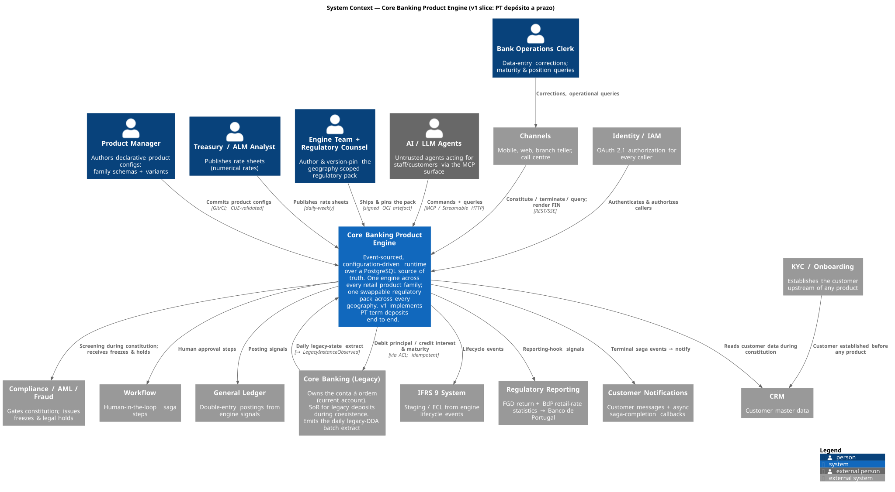

<sub>Source: [`diagrams/c4-l1-system-context.puml`](./diagrams/c4-l1-system-context.puml) · regenerate with `plantuml -tsvg docs/product-management/product_concepts/diagrams/c4-l1-system-context.puml`</sub>

### Narrative

**The system in focus** is the three-part deliverable from [00 §3](./00-product-vision.md): the product-engine runtime, the event store + bitemporal projections, and the swappable regulatory pack. They are one cohesive system; operating any two without the third is half a product, so they sit inside one box at this zoom.

**The people are the configuration-surface authors plus operations.** The surface splits three ways by owner and cadence ([01 §3](./01-product-architecture.md)): the **Product Manager** commits declarative product configs (family schemas + variants, CUE-validated per [ADR-PC-006](./adrs/ADR-PC-006-cue-schema-language.md)); **Treasury/ALM** publishes rate sheets on a daily–weekly beat; the **Engine team + Regulatory counsel** ship and version-pin the pack ([ADR-PC-007](./adrs/ADR-PC-007-signed-yaml-oci-pack.md)). Modelling these as three distinct relationships — not one "admin" — is the whole point of the split: the cheapest change (a rate) must not inherit the most expensive approval (a product redesign). The **Bank Operations Clerk** reaches the engine through channels for corrections (`DepositCorrected`, [02 §2.4.1](./02-v1-scope-term-deposits.md)) and operational queries.

**End customers are not drawn as direct users** — they act *through* Channels, which is the system that talks to the engine. **AI / LLM Agents** are drawn as an external actor because the chat-agent strategy ([integration_concepts §11](../integration_concepts/11-chat-agent-channel-strategy.md), [ADR-IC-010](../integration_concepts/adrs/ADR-IC-010-mcp-server-runtime-and-sdk.md)) makes them a first-class, *untrusted* caller of the same command/query surface, gated by the same IAM.

**Coexistence is the one bidirectional, asymmetric relationship.** A PT term deposit is constituted from and matures into a *conta à ordem* that — in the v1 strangler-fig slice — still lives in the **legacy Core Banking** system ([02 §3](./02-v1-scope-term-deposits.md)). The engine debits/credits that account through the anti-corruption layer (idempotent, indeterminate-state-aware) and never shadows its balance. In the other direction, the legacy core's **daily batch extract** is the engine's only feed of legacy state, surfacing as `LegacyInstanceObserved` ([feature-design-strangler-fig-coexistence](./feature-design-strangler-fig-coexistence.md)). The ACL and the broker that carry these exchanges are integration-estate; they appear at Level 2.

**Constitution is a saga, so several neighbours are saga participants, not request/response dependencies.** CRM, Workflow, and Notifications each take part in the constitution flow ([01 §6](./01-product-architecture.md), [integration_concepts §05](../integration_concepts/05-constitution-saga-walkthrough.md)). The engine **participates as a step**; it does not run the saga (the orchestrator is [ADR-IC-003](../integration_concepts/adrs/ADR-IC-003-saga-orchestrator.md), an estate element shown at Level 2). **Compliance/AML is *not* an in-saga participant:** AML/KYC adjudication is upstream and **out of scope** for the engine ([00 §4](./00-product-vision.md), [ADR-PC-024](./adrs/ADR-PC-024-constitution-precondition-contract.md)); the engine records precondition *verdicts*, it never makes them. KYC sits upstream of CRM — a customer exists before they hold a product.

**Downstream consumers receive events and pack-defined signals, never queries against the store.** GL, IFRS 9, and Regulatory Reporting are consumers of the engine's emissions ([01 §2](./01-product-architecture.md)): the engine guarantees the signals are present, correct, and timely; the reports/postings are built downstream. The PG `events` table is not a public interface — consumers see published topics ([ADR-PC-001 Consequences](./adrs/ADR-PC-001-event-store-technology.md), [ADR-PC-028](./adrs/ADR-PC-028-event-store-payload-format.md)).

### Scope boundary at this level

The v1 example is a term deposit, but the engine's *product scope* has since been fixed deliberately by [ADR-PC-030](./adrs/ADR-PC-030-product-scope-and-boundary.md): babelstone is a **core product & account ledger** — it owns product math, the account lifecycle, transactional balance accounts, and the **funds-and-rules core of real-time authorization** (the `available balance` check, the pack-rule limits, the hold), answered as a real-time dependency of the payment path. The dividing line is **"decide and record" (in) vs "physically move / authenticate / screen" (out)**. So the scope table reads:

| In scope (drawn inside `engine`) | Out of scope as products, in scope as integration (drawn as `System_Ext`) |
|---|---|
| Engine runtime; event store + bitemporal projections; regulatory pack; product math; the **account lifecycle**, **transactional balance accounts**, and the **ledger-and-rules core of authorization** (hold lifecycle + available-balance funds check, [ADR-PC-030](./adrs/ADR-PC-030-product-scope-and-boundary.md) / [ADR-PC-033](./adrs/ADR-PC-033-account-abstraction-and-hold-lifecycle.md)) | Channels, Core Banking, Compliance/AML/Fraud, CRM, Workflow, KYC, GL, IFRS 9, Regulatory Reporting, Notifications, IAM — and everything that *physically moves money or authenticates/screens a payer* (rails/scheme, clearing, settlement, SCA, fraud, origination/underwriting) |

Out-of-scope-entirely for v1 (no relationship drawn): structured/FX deposits, secondary-market trading, non-resident & joint-holder deposits, the assembled FGD *return* itself ([02 §4](./02-v1-scope-term-deposits.md)). Payments rails (SEPA/TARGET2) sit behind Core Banking — how the *conta à ordem* moves money is a payments concern downstream of the legacy core ([00 §4](./00-product-vision.md)). The **family roadmap** ([ADR-PC-030](./adrs/ADR-PC-030-product-scope-and-boundary.md)) is: `term_deposit` (built) → `personal_loan` (built, [ADR-PC-031](./adrs/ADR-PC-031-personal-loan-family.md)) → `credit_card` (revolving slice) → `conta à ordem` (the transactional account the others settle against).

---

## Level 2 — Container

One container diagram would bloat: the engine's world is ~12 runtime containers plus the ~11 external systems from Level 1. So this level is **four flow-focused diagrams** — each tells one story end-to-end and is readable alone — plus a cross-cutting observability note. The colour legend is the one defined in [The separation model](#the-separation-model--three-planes-the-spine) above.

**Container inventory** (each appears in one or more of the four diagrams):

| Container | Plane / class | Tech | Source |
|---|---|---|---|
| Engine process | 🟦 build / generic substrate | C# / .NET 10, single deployable | [ADR-PC-010](./adrs/ADR-PC-010-dotnet-hand-rolled-engine.md) |
| Engine PostgreSQL | 🟦 build | PostgreSQL: events + outbox + projections + read models + `command_dedup` + `pack_versions` (saga state is **not** here — see orchestrator) | [ADR-PC-001](./adrs/ADR-PC-001-event-store-technology.md), [ADR-IC-005](../integration_concepts/adrs/ADR-IC-005-cqrs-read-model-storage.md) |
| `pack-validate` | 🟦 build | Go static binary | [ADR-PC-006](./adrs/ADR-PC-006-cue-schema-language.md) |
| Saga orchestrator (substrate + family modules) | 🟩 estate (in-house) / generic substrate hosting 🟨 family saga modules | C# / .NET, Kestrel edge + Redpanda consumer | [ADR-IC-003](../integration_concepts/adrs/ADR-IC-003-saga-orchestrator.md), [ADR-IC-018](../integration_concepts/adrs/ADR-IC-018-family-owned-saga-modules.md) |
| Orchestrator PostgreSQL | 🟩 estate | PostgreSQL: `saga_state` + `saga_transition` + `saga_outbox` + inbox; own role `babelstone_orchestrator` | [ADR-IC-018](../integration_concepts/adrs/ADR-IC-018-family-owned-saga-modules.md), [ADR-PC-001 §P3](./adrs/ADR-PC-001-event-store-technology.md) |
| Kong Gateway CE | 🟩 estate (3rd-party) | Kong / nginx, DB-less | [ADR-IC-006](../integration_concepts/adrs/ADR-IC-006-edge-api-gateway.md) |
| Redpanda CE + Schema Registry | 🟩 estate (3rd-party) | Kafka API + Confluent SR | [ADR-IC-001](../integration_concepts/adrs/ADR-IC-001-event-backbone-message-broker.md) / [002](../integration_concepts/adrs/ADR-IC-002-schema-format-and-registry.md) |
| ACL service + ACL PostgreSQL | 🟩 estate (in-house) | dedicated service per bounded context, own DB | [ADR-IC-012](../integration_concepts/adrs/ADR-IC-012-anti-corruption-layer-implementation.md), [ADR-PC-016](./adrs/ADR-PC-016-legacy-current-account-adapter.md) |
| MCP server | 🟩 estate (in-house) | Python, Streamable HTTP | [ADR-IC-010](../integration_concepts/adrs/ADR-IC-010-mcp-server-runtime-and-sdk.md) |
| Notification service (scheduler core + family rules) + its PostgreSQL | 🟩 estate (in-house) / generic core hosting 🟨 family rules | service + delivery/dedupe store | [ADR-IC-011](../integration_concepts/adrs/ADR-IC-011-async-saga-completion-notification.md), [ADR-IC-019](../integration_concepts/adrs/ADR-IC-019-family-agnostic-notification-platform.md), [ADR-PC-025](./adrs/ADR-PC-025-customer-notification-emit-contract.md) |
| OCI registry | 🟩 estate | artefact registry (cosign-signed packs) | [ADR-PC-007](./adrs/ADR-PC-007-signed-yaml-oci-pack.md) |
| OTel Collector → Grafana LGTM | 🟩 estate (3rd-party) | observability pipeline | [ADR-IC-007](../integration_concepts/adrs/ADR-IC-007-observability-stack.md) |

### L2.1 — Runtime write/read path & legacy integration

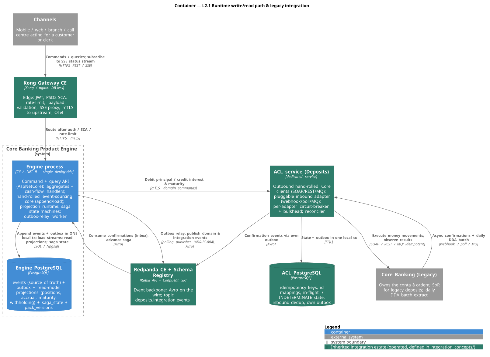

<sub>Source: [`diagrams/c4-l2-runtime-write-read.puml`](./diagrams/c4-l2-runtime-write-read.puml)</sub>

The heart of the engine. A state-changing flow enters through **Kong**, which has already done JWT validation, PSD2 SCA enforcement, rate-limiting, and payload validation at the edge and forwards over mTLS ([ADR-IC-006](../integration_concepts/adrs/ADR-IC-006-edge-api-gateway.md)). For a **saga-shaped** operation (constitution) Kong forwards to the **orchestrator's edge front door**, which starts the saga and returns `202 Accepted` with a `process_id` and an SSE `stream_url` ([ADR-IC-006 §P4](../integration_concepts/adrs/ADR-IC-006-edge-api-gateway.md), [05 §Step 0](../integration_concepts/05-constitution-saga-walkthrough.md)); the saga then drives the engine. For a **direct** command (and for the synchronous authorization path) the caller reaches the engine's **command ingress** — a synchronous, idempotent REST surface keyed by a caller-supplied command id ([ADR-PC-029](./adrs/ADR-PC-029-engine-command-ingress.md)): a replayed command id returns the original outcome with no second append.

Inside the **engine process**, the family **decider** folds the command into events (resolving the rate/calc-context first), and the hand-rolled event-sourcing core appends the event rows **and** the outbox row in **one local PostgreSQL transaction** — the atomic seam ([ADR-PC-001 §P2](./adrs/ADR-PC-001-event-store-technology.md), [ADR-IC-004](../integration_concepts/adrs/ADR-IC-004-outbox-pattern-mechanism.md)) that makes the outbox pattern correct without a dual write — plus the `command_dedup` row that makes the ingress idempotent ([ADR-PC-029](./adrs/ADR-PC-029-engine-command-ingress.md)). The **outbox-relay worker** ([ADR-IC-004](../integration_concepts/adrs/ADR-IC-004-outbox-pattern-mechanism.md)) relays committed rows to **Redpanda** as Avro. The `events.payload` written to the store is **self-describing JSON**, decoupled from the bus's Avro ([ADR-PC-028](./adrs/ADR-PC-028-event-store-payload-format.md)). Queries are served from read-model projections in the same database ([ADR-IC-005](../integration_concepts/adrs/ADR-IC-005-cqrs-read-model-storage.md)).

**Money moves append-first.** Every cash leg — a deposit taking principal in, a loan paying principal out, a maturity payout — is recorded as a single-sided, family-agnostic `Movement` carried *inside* the money-moving event and written in that same outbox transaction ([ADR-PC-032](./adrs/ADR-PC-032-money-movement-primitive.md)). The fact is durable first; the cash itself is a **downstream gated consequence** driven by the settlement saga (L3.3), never a precondition of the append. The legacy seam is deliberately indirect: the engine/orchestrator never call Core Banking directly. Domain commands go over mTLS to the dedicated **ACL service** ([ADR-IC-012 D1](../integration_concepts/adrs/ADR-IC-012-anti-corruption-layer-implementation.md), [ADR-IC-016 §2](../integration_concepts/adrs/ADR-IC-016-service-identity-and-mtls.md) — the ACL command port accepts **only** the orchestrator's identity), which owns its own PostgreSQL and outbox, translates to the Core's SOAP/REST/MQ surface, enforces per-operation idempotency, and models the `INDETERMINATE` state explicitly so a lost confirmation never becomes a double debit. Core confirmations (and the daily DDA batch) arrive through the ACL's pluggable inbound adapter and are published back through Redpanda. The current account stays *read-through, not owned* ([02 §3](./02-v1-scope-term-deposits.md)).

### L2.2 — Event backbone & downstream consumers

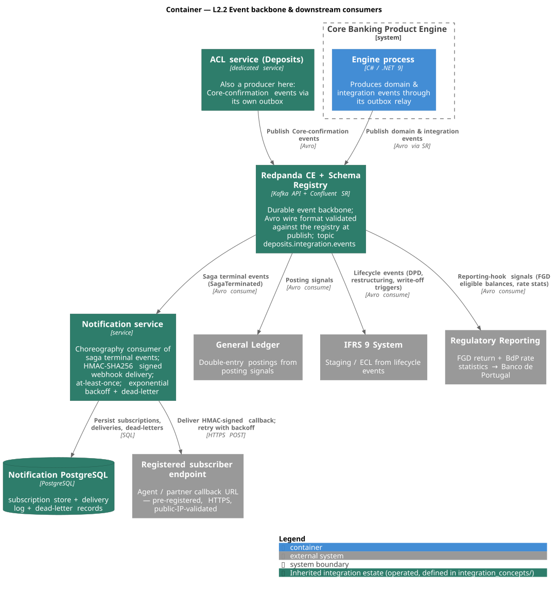

<sub>Source: [`diagrams/c4-l2-event-backbone-consumers.puml`](./diagrams/c4-l2-event-backbone-consumers.puml)</sub>

Once an event is committed, the outbox relay puts it on **Redpanda** — the **only** public interface to the engine's history; the `events` table itself is private ([ADR-PC-001](./adrs/ADR-PC-001-event-store-technology.md)). Publication is **catalog-gated and fail-closed**: the relay publishes an event **if and only if** its `event_type` resolves to a governed EventCatalog/`.avsc` entry ([ADR-IC-017](../integration_concepts/adrs/ADR-IC-017-integration-event-promotion-criterion.md)). An un-promoted `DomainEvent` stays store-only JSON — folded and replayable, never on the bus. Promoted payloads are Avro, validated against the built-in **Schema Registry** at publish ([ADR-IC-002](../integration_concepts/adrs/ADR-IC-002-schema-format-and-registry.md)). The fan-out is pure choreography: the **General Ledger** consumes posting signals ([ADR-PC-012](./adrs/ADR-PC-012-gl-posting-signal-contract.md)), **IFRS 9** consumes lifecycle events ([ADR-PC-015](./adrs/ADR-PC-015-ifrs9-signal-contract.md)), and **Regulatory Reporting** consumes the pack-defined reporting-hook signals (FGD eligible balances, BdP rate statistics). The **ACL** appears here too — as a *producer* of Core-confirmation events. (The choreography is shown concretely in [Behaviour & data views](#dynamic--data-views-beyond-c4) below.)

The **notification service** is no longer a single saga-terminal webhook deliverer; it is a **family-agnostic scheduler core hosting family-owned rules** ([ADR-IC-019](../integration_concepts/adrs/ADR-IC-019-family-agnostic-notification-platform.md)). The generic core owns the per-tick poll loop, the composite `notification_id`, the dedupe ledger, the read client, and the outbox; it **owns a clock** and polls the maturity calendar ([ADR-PC-023 §6](./adrs/ADR-PC-023-temporal-signals-projection-derived.md)). What is *family-shaped* — that a term deposit fires a `pt.notice.maturity` reminder in a 14-day pre-maturity window — lives in a per-family `IFamilyNotificationModule` rule that plugs into the core (the same module shape as the engine's `IFamilyHostModule` and the orchestrator's `ISagaModule`). It still delivers HMAC-SHA256-signed, at-least-once callbacks to *pre-registered* subscriber endpoints with exponential backoff + dead-letter. Event contracts are governed offline as Git-native AsyncAPI, rendered by Backstage ([ADR-IC-015](../integration_concepts/adrs/ADR-IC-015-event-catalog-governance-tooling-backstage.md)) — not drawn, because it is not on the runtime path.

### L2.3 — Configuration & regulatory-pack plane

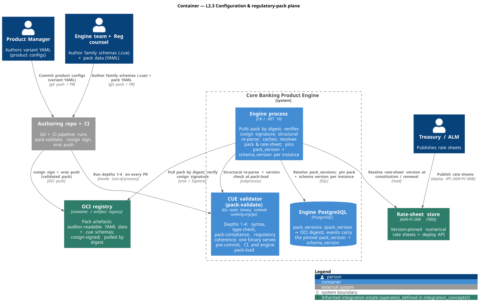

<sub>Source: [`diagrams/c4-l2-config-pack-plane.puml`](./diagrams/c4-l2-config-pack-plane.puml)</sub>

The configuration surface is three artefacts with three owners and cadences ([01 §3](./01-product-architecture.md)): **product configs** (PM), **rate sheets** (Treasury/ALM), and the **regulatory pack** (engine team + regulatory counsel). Authoring flows through Git/CI, where the **CUE validator** (`pack-validate`, a single Go binary, [ADR-PC-006](./adrs/ADR-PC-006-cue-schema-language.md)) runs validation depths 1–4 (syntax, type, pack-compliance, regulatory coherence). On pass, CI cosign-signs the pack — auditor-readable YAML data plus `.cue` schemas — and `oras`-pushes it to the **OCI registry** ([ADR-PC-007](./adrs/ADR-PC-007-signed-yaml-oci-pack.md)). (The full supply chain is drawn as a data-flow in [Behaviour & data views](#dynamic--data-views-beyond-c4).)

At pack-load the **engine** pulls by digest, verifies the cosign signature — which *attests CUE validation already passed*, so the engine only structurally re-parses rather than re-running `cue vet` ([ADR-PC-006 §P3](./adrs/ADR-PC-006-cue-schema-language.md)) — caches, and resolves primitives/parameters in memory. Every constituted instance **pins** its `pack_version` and `schema_version` for life, carried on every event ([ADR-PC-007 §P3](./adrs/ADR-PC-007-signed-yaml-oci-pack.md), [ADR-PC-009](./adrs/ADR-PC-009-per-instance-version-pinning.md)). The CUE validator is the engine's *one accepted out-of-process seam* ([ADR-PC-010](./adrs/ADR-PC-010-dotnet-hand-rolled-engine.md)) — invoked only at commit/CI and pack-load, never on the request path. Rate-sheet storage and its deploy API are version-pinned ([ADR-PC-008](./adrs/ADR-PC-008-rate-sheet-storage-and-deploy-api.md)).

### L2.4 — Agent channel & async completion

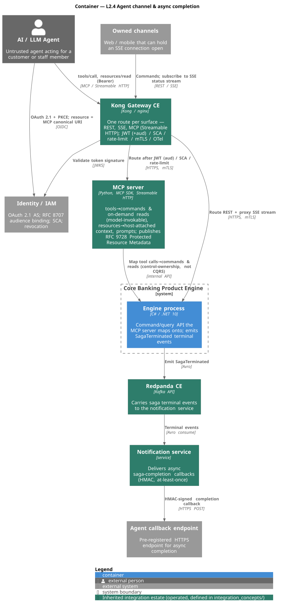

<sub>Source: [`diagrams/c4-l2-agent-channel.puml`](./diagrams/c4-l2-agent-channel.puml)</sub>

The agent surface adds two estate containers, not a rewrite. An **AI/LLM agent** first obtains an OAuth 2.1 token from the **existing IAM** — reused, not a second authorization server ([ADR-IC-010 Area 4](../integration_concepts/adrs/ADR-IC-010-mcp-server-runtime-and-sdk.md)) — with PKCE and an RFC 8707 `resource` binding to the MCP server's canonical URI. It then calls the **MCP server** (Python SDK, Streamable HTTP) through the *same* **Kong** route family as REST, so JWT/SCA/rate-limit are uniform; Kong validates the token signature against the IAM's JWKS. The MCP server maps `tools` onto the engine's commands and on-demand reads — the tool/resource split is control-ownership, not the engine's internal CQRS ([ADR-IC-010](../integration_concepts/adrs/ADR-IC-010-mcp-server-runtime-and-sdk.md)'s 2026-05-31 amendment). Tool calls land on the same **idempotent command ingress** ([ADR-PC-029](./adrs/ADR-PC-029-engine-command-ingress.md)) that REST and the orchestrator use; there is **one ingress**, and the durable bus stays events-only ([ADR-PC-034 §5](./adrs/ADR-PC-034-realtime-authorization-technique.md)).

Because an MCP session may end before a long-running saga finishes ([ADR-IC-011](../integration_concepts/adrs/ADR-IC-011-async-saga-completion-notification.md)), completion is pushed: the saga emits a terminal event → Redpanda → the **notification service** → an HMAC-signed callback to the agent's pre-registered endpoint. Owned web/mobile channels that *can* hold a connection use **SSE** for live progress instead — the orchestrator's `GET /api/v1/processes/{id}/stream`, which streams the structural saga state (never PII) and enforces per-process ownership ([ADR-IC-011 D6](../integration_concepts/adrs/ADR-IC-011-async-saga-completion-notification.md)); the two completion paths coexist.

### Observability (cross-cutting — stated, not drawn)

Every container above — engine, orchestrator, ACL, MCP server, notification service, plus Kong and Redpanda — emits OpenTelemetry logs, metrics, and traces to the **OTel Collector**, which fans out to **Grafana LGTM** (Loki + Grafana + Tempo + Prometheus, [ADR-IC-007](../integration_concepts/adrs/ADR-IC-007-observability-stack.md)). Kong injects `traceparent` at the edge so one trace spans gateway → orchestrator → engine → saga → downstream consumer ([ADR-IC-006 §P6](../integration_concepts/adrs/ADR-IC-006-edge-api-gateway.md)). Telemetry is held to the **same no-PII rule as the durable bus**: a runtime emit-time guard plus the **BENG005** build-time analyser reject PII on any trace/log/metric attribute (catalogue `OBS_NO_PII_ATTRS`, Live). Service-to-service hops are mutually authenticated with mTLS, certificates issued from the OpenBao secret boundary and never carried on a saga message or the bus ([ADR-IC-016](../integration_concepts/adrs/ADR-IC-016-service-identity-and-mtls.md)). It is a note rather than a diagram because every container points at the collector — drawing it produces an N-to-1 hairball that buries the flows the four diagrams exist to show.

## Level 3 — Component

Zooms into the **Engine process** container (the orchestrator's internals are covered by L3.3 and the saga behaviour views below). Like Level 2, it is split by path into four component diagrams — **L3.1 Write core · L3.2 Projection & query · L3.3 Messaging & saga · L3.4 Loading & config** — so each stays readable. The gold/blue/teal/grey legend is the one from [The separation model](#the-separation-model--three-planes-the-spine).

### Where the financial mathematics lives

A natural question: the [financial_concepts](../financial_concepts/banking_products_financial_mathematics.md) functions — balance evolution, day-count, compounding, accrual, amortization, TAE, PV/IRR — have to sit *somewhere*. They split into three homes (the three planes), and conflating them would break the unification thesis:

| Thing | Example | Plane / home | Source |
|---|---|---|---|
| **Math kernel** (executable primitives) | `S(t+Δt)=S(t)(1+r·Δt)−pay+draw`, Act/360, compounding, `J=ΣS·r·Δt`, **amortization schedule**, TAE, TANB/TANL split, PV/IRR | ① **Engine** — one generic, family-agnostic component | [01 §1](./01-product-architecture.md) "one balance-evolution function, invoked with different parameters"; [00 §3](./00-product-vision.md) |
| **Orchestration** | "accrue at maturity / periodically / in advance, then withhold"; "disburse, then amortize over N installments" | ② **Family decider + pure folds** (loaded) | [event-store §3, §5](./feature-design-event-store-projections.md), [ADR-PC-021](./adrs/ADR-PC-021-application-layer-family-owned-deciders.md) — the decider *calls* primitives, never re-implements them |
| **Parameters** | day-count = Act/360, withholding = 2800 bps, the TAN value | ③ **Pack + variant config + rate sheet** (declarative data) | [00 §3](./00-product-vision.md); [ADR-PC-007](./adrs/ADR-PC-007-signed-yaml-oci-pack.md) |

The license to put the math in the engine is the unification proof itself ([financial_concepts §9.2](../financial_concepts/banking_products_financial_mathematics.md)): because one equation governs deposits, credits, current accounts, and cards, the kernel is **one** family-agnostic engine component — not per-family math. The kernel is drawn in L3.1 (where the decider invokes it) and reused by the accrual/amortization-schedule projector in L3.2. The **two families that exist today** — `term_deposit` and `personal_loan` — share that one kernel; the loan family adds only its amortization *orchestration*, not new math ([ADR-PC-031](./adrs/ADR-PC-031-personal-loan-family.md)). See [One engine, many families](#one-engine-many-families).

### L3.1 — Write core: command → decider → append

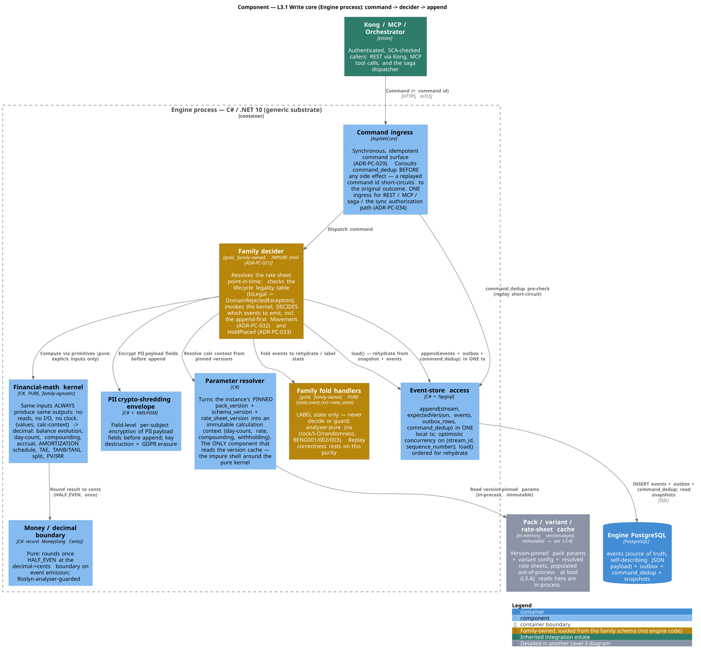

<sub>Source: [`diagrams/c4-l3-write-core.puml`](./diagrams/c4-l3-write-core.puml)</sub>

A command arrives already authenticated and SCA-checked — from Kong/REST, the MCP server, or the orchestrator's saga dispatcher — at the engine's **command ingress** ([ADR-PC-029](./adrs/ADR-PC-029-engine-command-ingress.md)). The ingress consults the `command_dedup` ledger **before any side effect**: a replayed command id short-circuits to the original outcome with no second decide/append. It then hands the command to the family **decider** — the application layer split that [ADR-PC-021](./adrs/ADR-PC-021-application-layer-family-owned-deciders.md) makes explicit, and the central correction this view restores:

- The **decider** (gold, family-owned) is the **impure command shell**: it resolves the active rate sheet point-in-time, checks the **lifecycle legality table** (`LifecycleTransitions.IsLegal` — reject an illegal transition with `DomainRejectedException`), invokes the kernel, and decides *which events to emit*. It does I/O (rate-sheet resolve) and orchestrates; it is the family's `…ConstitutionService`/`…Decider` pair.
- The **fold handlers** (gold, family-owned) are **pure** `(state, event, ctx) → new_state`: they only *label* state, never decide or guard, and are analyser-enforced free of clock/I/O/randomness. Replay correctness rests on this purity.

The decider delegates every calculation to the **financial-math kernel** — the one generic balance-evolution function and its day-count / compounding / accrual / amortization / withholding / PV-IRR primitives. The kernel is a **pure function**: same inputs always produce same outputs — no reads, no I/O, no clock — so it never fetches its own parameters. Instead the **parameter resolver** (the *only* component that touches the version cache) turns the instance's **pinned** `pack_version` + `schema_version` + `rate_sheet_version` into an immutable **calculation context** (day-count, rate, compounding, withholding), passed to decider and kernel as an explicit argument (the functional-core / imperative-shell split). Because those versions are immutable — pack pinned by OCI digest, rate sheet by id — replaying a 2026 event re-resolves the identical 2026 context years later. The cache read is **in-process**; the *out-of-process* work that fills it (OCI pull, cosign verify, the CUE subprocess) is in L3.4.

Every cash leg the decider decides is recorded as a `Movement` ([ADR-PC-032](./adrs/ADR-PC-032-money-movement-primitive.md)) — single-sided, family-agnostic, an opaque `AccountRef` (never PII), carried inside the event's payload and written **append-first**; `MovementOrigin.Originated` means its cash leg is then effected by the gated settlement saga (L3.3). The same ingress carries the **synchronous authorization** path ([ADR-PC-034](./adrs/ADR-PC-034-realtime-authorization-technique.md)): the caller blocks, the decider runs the pure authorization decision against the available balance, appends `HoldPlaced` (or a refusal) in the outbox transaction, and returns the verdict — concurrent authorizations serialised by optimistic concurrency on `(stream_id, sequence_number)`, no locking ([ADR-PC-033](./adrs/ADR-PC-033-account-abstraction-and-hold-lifecycle.md)). The kernel computes in full-precision `decimal` and rounds each result exactly once through the **Money / decimal boundary** (HALF_EVEN at the decimal→cents boundary, [ADR-PC-010 §P1–P2](./adrs/ADR-PC-010-dotnet-hand-rolled-engine.md)).

Before the new events are written, the **PII crypto-shredding envelope** encrypts the PII payload fields per subject so key destruction is GDPR-Article-17 erasure ([event-store §6.2](./feature-design-event-store-projections.md)). Finally the **event-store access** layer performs the load-bearing `append(stream, expectedVersion, events, outbox_rows, command_dedup)` — event rows, the outbox row, and the dedup row in **one local PostgreSQL transaction**, with optimistic concurrency on `(stream_id, sequence_number)` ([ADR-PC-001 §P2](./adrs/ADR-PC-001-event-store-technology.md), [ADR-IC-004](../integration_concepts/adrs/ADR-IC-004-outbox-pattern-mechanism.md), [ADR-PC-029](./adrs/ADR-PC-029-engine-command-ingress.md)). Two build-time disciplines guard this path and so are not drawn as components: a Roslyn analyser bans raw `decimal` rounding outside `Money.FromCents`, and a CI determinism gate rejects any handler that reads the clock, calls out, or otherwise breaks replayability ([event-store §5.3, §10.3](./feature-design-event-store-projections.md)).

### L3.2 — Projection & query: event log → bitemporal read models

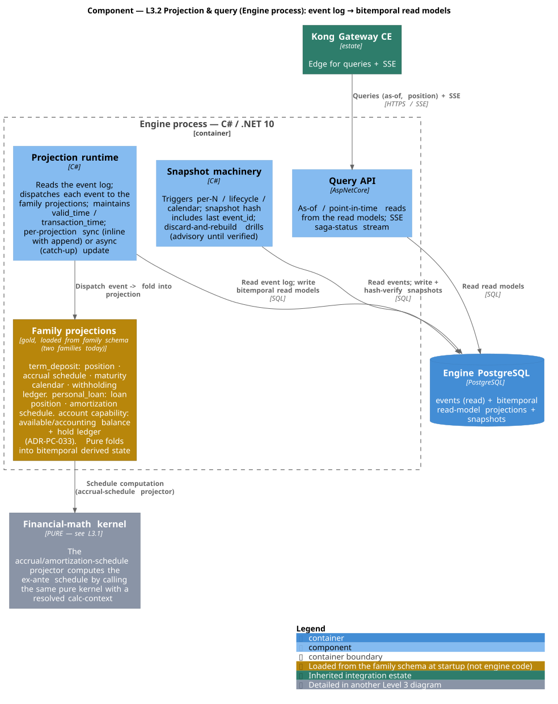

<sub>Source: [`diagrams/c4-l3-projection-query.puml`](./diagrams/c4-l3-projection-query.puml)</sub>

The read side derives state from the log. The **projection runtime** reads the event log and dispatches each event to the **family projections** (gold — loaded from the family schema, like folds and the decider): deposit position, accrual schedule, maturity calendar, withholding ledger ([02 §2.3](./02-v1-scope-term-deposits.md)); the loan family adds its amortization-schedule and loan-position projections; the account capability adds the **available/accounting balance split and the hold ledger** ([ADR-PC-033](./adrs/ADR-PC-033-account-abstraction-and-hold-lifecycle.md)). Projections are pure folds carrying both time dimensions — `valid_time` (when the fact was true) and `transaction_time` (when we recorded it) — so a retroactive `DepositCorrected` leaves *both* "what we thought" and "what we now know" queryable ([event-store §6](./feature-design-event-store-projections.md), [ADR-PC-002](./adrs/ADR-PC-002-application-level-bitemporality.md)). Temporal signals (e.g. the maturity calendar the notification scheduler polls) are **projection-derived**, not clock-driven facts on the log ([ADR-PC-023](./adrs/ADR-PC-023-temporal-signals-projection-derived.md)). Each projection updates either **synchronously** (inline with the append transaction) or **asynchronously** (a catch-up reader of the log), per projection ([01 §4](./01-product-architecture.md)).

The **accrual/amortization-schedule projector** is where the kernel reappears: for a with-a-plan family it computes the ex-ante schedule by calling the *same pure kernel* with a resolved calc-context — so a schedule rebuilt by replay is identical to the original. The **query API** serves as-of / point-in-time reads (and the SSE status stream) from the read models behind Kong; the canonical deposit read surface is [ADR-PC-027](./adrs/ADR-PC-027-deposit-read-surface-canonical-resource.md). The **snapshot machinery** is performance-only: it triggers per-N-events / at lifecycle boundaries / at calendar boundaries, stamps each snapshot with the last `event_id` it covers for hash-verification, and is discarded-and-rebuilt in the monthly drill — a snapshot is advisory until it has survived that drill ([event-store §8](./feature-design-event-store-projections.md), [ADR-PC-003](./adrs/ADR-PC-003-postgresql-snapshots.md)).

### L3.3 — Messaging & saga: outbox, inbox, and the orchestrator substrate

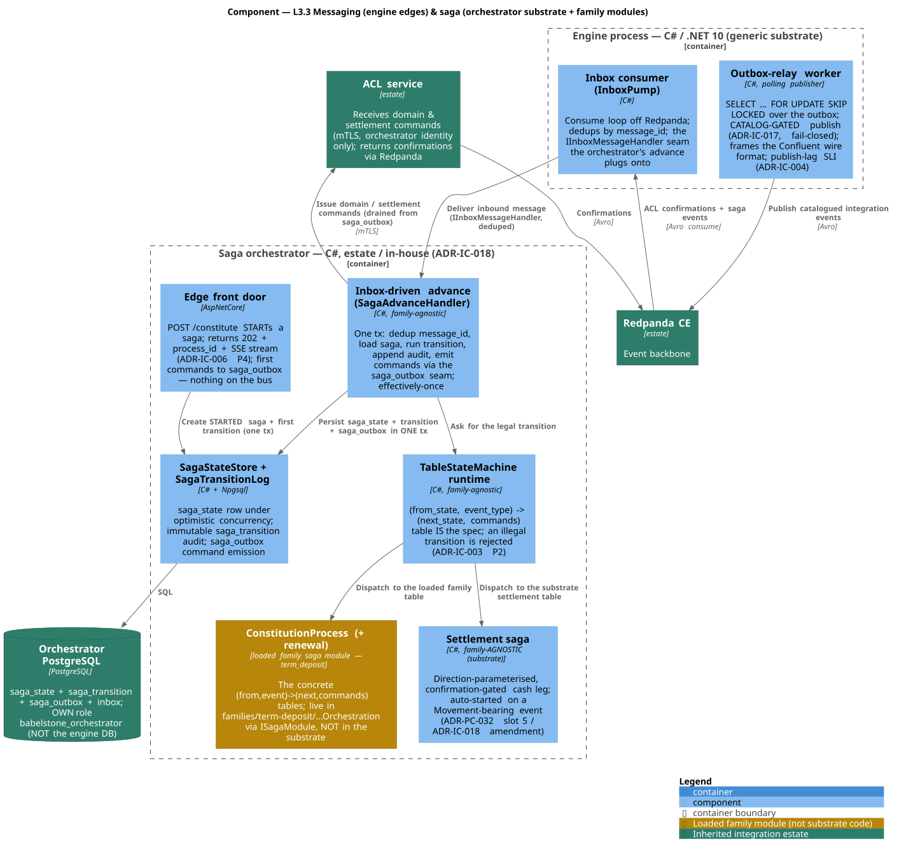

<sub>Source: [`diagrams/c4-l3-messaging-saga.puml`](./diagrams/c4-l3-messaging-saga.puml)</sub>

The asynchronous edges and orchestration — and the most important structural correction in this refresh: **sagas do not run in the engine process.** The engine owns only the messaging edges; the saga machinery is the orchestrator's, and the concrete sagas are family-owned modules.

Inside the **engine process**: the **outbox-relay worker** is the [ADR-IC-004](../integration_concepts/adrs/ADR-IC-004-outbox-pattern-mechanism.md) custom polling publisher — it claims rows with `SELECT … FOR UPDATE SKIP LOCKED`, applies the [ADR-IC-017](../integration_concepts/adrs/ADR-IC-017-integration-event-promotion-criterion.md) catalog gate, frames the Confluent wire format, and publishes to **Redpanda**, emitting a publish-lag SLI; and the **inbox consumer** (`InboxPump`) reads ACL confirmations and saga events off Redpanda and dedups by `message_id`.

The **saga substrate** lives in the **orchestrator** (🟩 estate, in-house — [ADR-IC-018](../integration_concepts/adrs/ADR-IC-018-family-owned-saga-modules.md)). It is family-agnostic machinery: the **`TableStateMachine`** runtime (the explicit `(from_state, event_type) → (next_state, commands)` table *is* the spec — an illegal transition is rejected, never silently applied, [ADR-IC-003 §P2](../integration_concepts/adrs/ADR-IC-003-saga-orchestrator.md)); the **`SagaStateStore` + `SagaTransitionLog`** (the saga aggregate is one `saga_state` row advanced under optimistic concurrency; every accepted move appends an immutable `saga_transition`); the **idempotent inbox-driven advance** (one transaction: dedup on message id, load, transition, persist audit, emit commands through the `saga_outbox` seam); and the **edge front door** (the `202` + `process_id` + SSE surface that *starts* a saga). The **concrete sagas are gold, family-owned modules** that plug into the substrate via `ISagaModule`: `ConstitutionProcess` (and the renewal saga) live in `families/term-deposit/…Orchestration/`, not in the substrate — the orchestrator's mirror of the engine's decider/fold separation. One family-agnostic exception is the **settlement saga** (next paragraph), which belongs to the substrate precisely because it is product-neutral.

Saga state is durable the orchestrator's way, in the **orchestrator's own database** under its own role `babelstone_orchestrator`: `saga_state`, the audit log, and the `saga_outbox` rows commit in **one local transaction**, so a saga can never advance without its commands being durably queued. Outbound commands to the **ACL** go over mTLS (the ACL accepts only the orchestrator's identity, [ADR-IC-016 §2](../integration_concepts/adrs/ADR-IC-016-service-identity-and-mtls.md)); confirmations return asynchronously through Redpanda, closing the loop the inbox started. The full constitution and settlement state machines are drawn in [Behaviour & data views](#dynamic--data-views-beyond-c4).

### L3.4 — Loading & config: pack/schema load → immutable cache

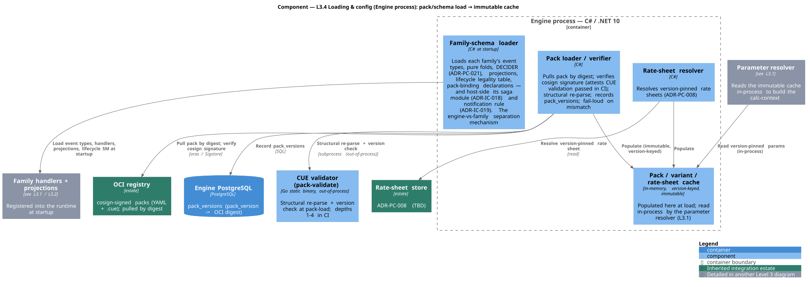

<sub>Source: [`diagrams/c4-l3-loading-config.puml`](./diagrams/c4-l3-loading-config.puml)</sub>

The genericity and configuration machinery — and the engine's out-of-process boundary. At startup the **family-schema loader** registers each family's event types, pure folds, decider, projections, lifecycle legality table, and (host-side) its saga and notification modules into the runtime (the L3.1/L3.2 components) — the loading mechanism that keeps the substrate generic and makes "one engine, many families" structural ([event-store §3](./feature-design-event-store-projections.md), [ADR-PC-021](./adrs/ADR-PC-021-application-layer-family-owned-deciders.md)). The **pack loader/verifier** pulls a pack from the **OCI registry** by digest, verifies its cosign signature (which attests CUE validation already passed in CI, so load is a structural re-parse rather than a full re-validation, [ADR-PC-006 §P3](./adrs/ADR-PC-006-cue-schema-language.md)), records the `pack_version → digest` mapping, and **fails loud** on any mismatch ([ADR-PC-007 §P4](./adrs/ADR-PC-007-signed-yaml-oci-pack.md)). The **rate-sheet resolver** does the same for version-pinned rate sheets ([ADR-PC-008](./adrs/ADR-PC-008-rate-sheet-storage-and-deploy-api.md)).

All of this populates the **immutable, version-keyed cache** that L3.1's parameter resolver reads *in-process*. That is what isolates every out-of-process call — the OCI pull, the cosign verification, the [CUE validator](./adrs/ADR-PC-006-cue-schema-language.md) Go subprocess — to load time, off the deterministic compute path. This diagram is the answer to "where does the out-of-process work go": here, never in the kernel.

---

## One engine, many families

This is the thesis the whole architecture argues — *one generic substrate, many product plugins* — made concrete. Two families exist today, and the cleanest proof of the separation is to put their **lifecycle legality tables side by side**: the *same* generic engine dispatches two differently-shaped but identically-disciplined tables, each **loaded from its family** ([ADR-PC-021](./adrs/ADR-PC-021-application-layer-family-owned-deciders.md), [ADR-PC-031](./adrs/ADR-PC-031-personal-loan-family.md)). Each table is the single source of truth its decider consults before appending; a transition with no row is illegal by construction. Note the shared shape: a single seed (`Pending`), one live state (`Active`) that carries the state-preserving operations, several distinct business-terminal closings, and the one cross-cutting `Erase` (GDPR Art. 17, [ADR-PC-004 §P3](./adrs/ADR-PC-004-pii-crypto-shredding.md)) legal from every state that still holds PII.

**`term_deposit` — a liability that accrues to maturity** (`families/term-deposit/.../LifecycleTransitions.cs`):

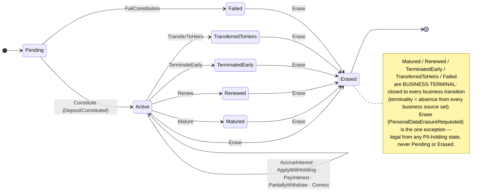

**`personal_loan` — a closed-end asset that amortizes to zero** (`families/personal-loan/.../LifecycleTransitions.cs`):

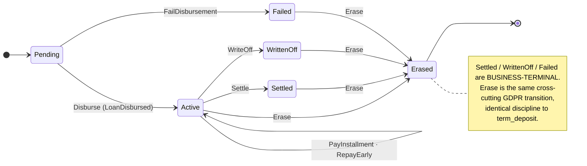

What makes this a *proof* rather than a coincidence: nothing in the generic engine knows "deposit" or "loan". The engine provides the runtime, the kernel, the resolvers, the append seam, and the `IsLegal` *mechanism*; each family supplies the *table*, the decider, the folds, the projections — and gets to `main` through a one-way `family → engine` arrow with zero generic-engine diff. A liability and an asset, same spine.

---

## Dynamic & data views (beyond C4)

C4 is purely structural: it shows what the pieces *are*, never the *order* steps happen in, the *legal* lifecycle transitions, or the *shape* of the persistence — and that is where babelstone's hardest correctness lives. These Mermaid views fill that gap. They render natively on GitHub; each is generated by hand from the cited code and kept beside the structural views it animates.

### D1 — Constitution saga, end-to-end (sequence)

The happy path plus every compensation/clearance fork, drawn from `families/term-deposit/.../Orchestration/ConstitutionProcess.cs` (`BuildTable()` is the literal spec) and the [05 walkthrough](../integration_concepts/05-constitution-saga-walkthrough.md). It makes visible what no C4 box can: the **reversibility ordering** (every reversible leg succeeds before any irreversible effect), the order-independent parallel join, and compensation-as-domain-action (a reversing credit, not a DB rollback). Note the plane tags on the participants — the *substrate* is family-agnostic; the *saga* is the family-owned module.

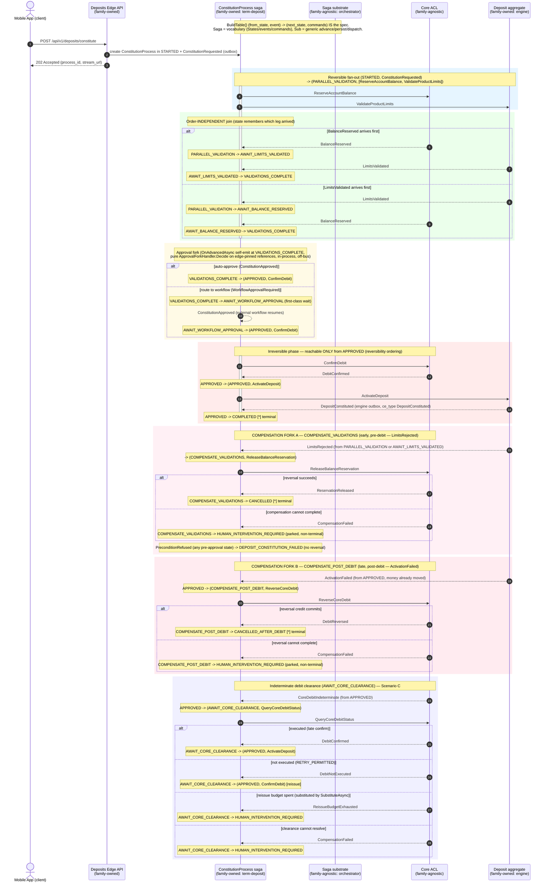

### D2 — Constitution saga, state machine

The same saga as its legal-transition surface — the audit-grade view, since `BuildTable()` *is* the specification ([ADR-IC-003 §P2](../integration_concepts/adrs/ADR-IC-003-saga-orchestrator.md): anything not in the table is rejected). Every edge below is one table row.

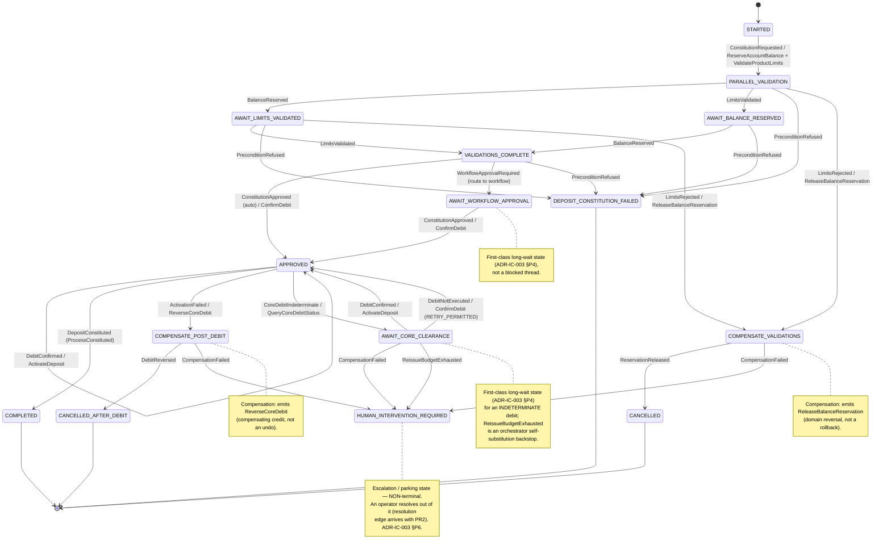

### D3 — Substrate settlement saga (direction-parameterised, confirmation-gated)

The one **family-agnostic** saga that lives in the substrate, because moving money is product-neutral ([ADR-PC-032 slot 5](./adrs/ADR-PC-032-money-movement-primitive.md), [ADR-IC-018 amendment](../integration_concepts/adrs/ADR-IC-018-family-owned-saga-modules.md); `orchestrator/.../Saga/Settlement/SettlementProcess.cs`). It auto-starts on a `Movement`-bearing event and branches on the promoted direction header: a **debit** is funds-gated (reserve → confirm), a **credit** is confirmation-gated (a single confirm). Its central insight — *the fact is final on append; the cash is a downstream gated consequence* — is a temporal property no C4 box can carry. An indeterminate result parks in a first-class wait; a refusal parks for an operator; it **never compensates** (money either moved or it did not, [ADR-IC-003 §P6](../integration_concepts/adrs/ADR-IC-003-saga-orchestrator.md)).

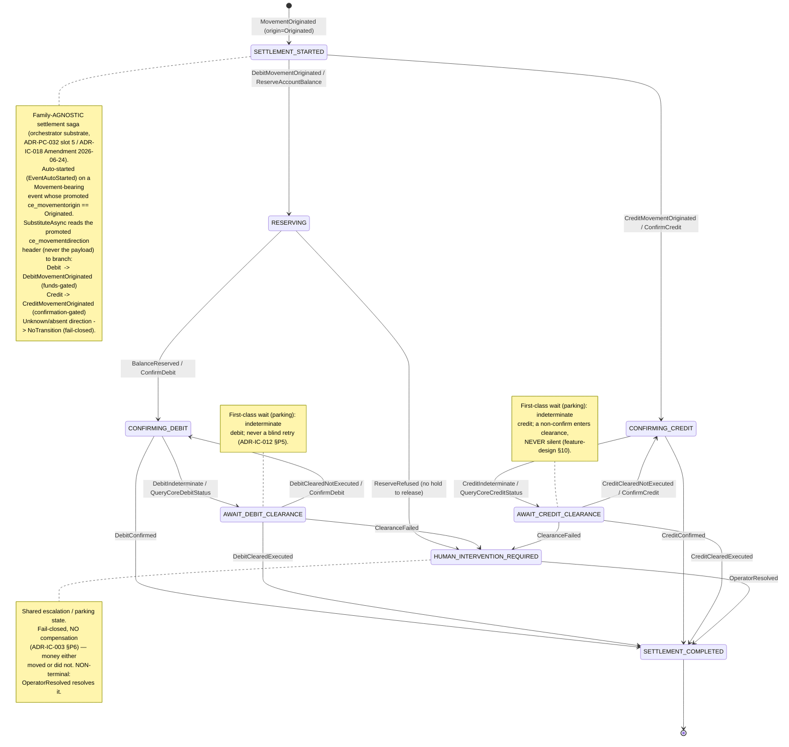

> The append-first money-movement model these two sagas rest on is specified in [feature-design-money-movement-settlement](./feature-design-money-movement-settlement.md).

### D4 — Engine persistence & the orchestrator's separate store (ER)

C4 draws "Engine PostgreSQL" as one box, but the correctness story lives in the table shapes: the **append-only `events` co-committed with `outbox`** (why the outbox pattern is correct without a dual write), the **bitemporal `projections`** with its world-time pair (`valid_from`/`valid_to`) and belief-time pair (`recorded_at`/`superseded_at`), the `command_dedup` ledger behind [ADR-PC-029](./adrs/ADR-PC-029-engine-command-ingress.md) idempotency, and — load-bearing for the separation story — the orchestrator's `saga_state`/`saga_outbox` in a **physically separate database under its own role** ([ADR-IC-018](../integration_concepts/adrs/ADR-IC-018-family-owned-saga-modules.md)), not in the engine DB. Drawn from the three forward-only migration series (engine event-store, term-deposit read model, orchestrator saga substrate).

```mermaid
erDiagram
    events {
        UUID event_id PK "stable id"
        UUID stream_id "stream"
        BIGINT sequence_number "per-stream monotonic"
        VARCHAR event_type
        VARCHAR family
        VARCHAR pack_version
        TIMESTAMPTZ valid_time "world time"
        TIMESTAMPTZ transaction_time "append-stamped"
        BYTEA payload "self-describing JSON; PII fields ciphertext"
    }
    outbox {
        UUID event_id PK "mirrors events.event_id"
        VARCHAR aggregate_type "= topic name"
        UUID aggregate_id
        VARCHAR status "PENDING-PUBLISHED"
        JSONB integration_headers "ce_ ext attrs"
    }
    snapshots {
        UUID stream_id PK "part of PK"
        BIGINT at_sequence PK "part of PK"
        TEXT state_hash "SHA-256"
        BOOLEAN trusted "advisory-until-drilled"
    }
    projections {
        BIGSERIAL row_id PK
        UUID stream_id
        TEXT projection_kind "family-prefixed"
        TIMESTAMPTZ valid_from "VALID-TIME start"
        TIMESTAMPTZ valid_to "VALID-TIME end (NULL=open)"
        TIMESTAMPTZ recorded_at "TXN-TIME belief start"
        TIMESTAMPTZ superseded_at "TXN-TIME belief end (NULL=current)"
        BIGINT source_sequence "idempotency guard"
    }
    command_dedup {
        UUID command_id PK "ADR-PC-029 idempotency key"
        UUID stream_id
        BIGINT commit_sequence "read-your-writes token"
    }
    pack_versions {
        VARCHAR pack_id PK "part of PK"
        VARCHAR pack_version PK "part of PK"
        VARCHAR image_digest "immutable OCI pin"
        VARCHAR signature_digest
    }
    read_model_deposits {
        UUID stream_id PK
        TEXT sor "engine|legacy routing truth"
        DATE maturity_date "range-scan key"
        TEXT lifecycle
        BIGINT last_sequence "monotonicity guard"
    }
    saga_state {
        UUID process_id PK "ORCHESTRATOR DB — separate role"
        VARCHAR saga_type "which state machine"
        VARCHAR state "current business state"
        BIGINT version "optimistic-concurrency guard"
        VARCHAR public_process_id "PROC- ref, UNIQUE"
        VARCHAR owning_client_id "SSE ownership"
    }
    saga_transition {
        BIGINT id PK
        UUID process_id FK
        VARCHAR from_state
        VARCHAR to_state
        VARCHAR event_type
    }
    saga_outbox {
        UUID message_id PK
        UUID process_id FK
        VARCHAR command_type
        BYTEA payload "byte-stable, no PII"
        VARCHAR status "PENDING-PUBLISHED-FAILED"
    }

    events ||--|| outbox : "co-committed in ONE local tx"
    events ||--o{ snapshots : "rebuildable cache of stream state"
    events ||--o{ projections : "fold -> bitemporal belief rows"
    events ||--o{ read_model_deposits : "fold -> flat CQRS read model"
    saga_state ||--o{ saga_transition : "append-only audit (ORCH DB)"
    saga_state ||--o{ saga_outbox : "atomically-committed commands (ORCH DB)"
```

### D5 — Outbox → Redpanda → downstream fan-out (choreography)

The pure-choreography claim of L2.2 made concrete (`engine/.../OutboxPublisher/OutboxDrainer.cs`): the relay claims `PENDING` rows under `FOR UPDATE SKIP LOCKED`, applies the [ADR-IC-017](../integration_concepts/adrs/ADR-IC-017-integration-event-promotion-criterion.md) **catalog gate** (publish iff catalogued, else store-only), frames the Confluent wire format with **no** registry lookup at publish, and produces to a topic named for the `aggregate_type`. Downstream, independent consumers react with **zero coordination** — the defining property a one-to-many container picture cannot convey.

```mermaid
flowchart LR
    subgraph engine["Engine append spine (generic-core)"]
        runtime["AggregateRuntime.AppendAsync"]
        gate{"IntegrationEventCatalog<br/>IsCataloguedIntegrationEvent(event_type)?<br/>(ADR-IC-017 P1, fail-closed)"}
        evrow[("events row<br/>(always written)")]
        obrow[("outbox row<br/>status = PENDING<br/>schema_id, integration_headers")]
        storeonly["events row only<br/>NO outbox row"]
        runtime --> gate
        gate -->|"yes: catalogued<br/>DepositConstituted, InterestPaid, DepositMatured"| evrow
        gate -->|"no: store-only<br/>folded + replayable, never on bus"| storeonly
        evrow -.->|"same transaction<br/>(ES_ATOMIC_APPEND_OUTBOX)"| obrow
    end

    subgraph relay["OutboxDrainer (IC-004 polling relay, generic-core)"]
        claim["claim PENDING rows<br/>per-aggregate advisory lock +<br/>FOR UPDATE SKIP LOCKED<br/>ORDER BY created_at, sequence_number"]
        wire["build value:<br/>0x00 then big-endian schema_id then Avro<br/>(no Schema-Registry lookup)"]
        ce["CloudEvents headers:<br/>ce_type = com.bank.deposits.EventName<br/>ce_subject = aggregate_id, ce_aggregatetype"]
        publish["ProduceAsync<br/>topic = aggregate_type (e.g. term_deposit)<br/>key = aggregate_id"]
        flip["UPDATE status = PUBLISHED<br/>published_at = clock_timestamp()"]
        obrow --> claim --> wire --> ce --> publish --> flip
        publish -.->|"produce throws: rollback<br/>rows stay PENDING, back off"| obrow
    end

    topic{{"Redpanda topic: term_deposit<br/>partitioned by aggregate_id"}}
    publish --> topic

    subgraph fanout["Independent consumers - pure choreography, zero coordination"]
        acl["ACL / core-banking projection<br/>(GL posting, IFRS 9 lifecycle, tax behind it)"]
        reporting["reporting consumer (ADR-IC-005)<br/>regulatory + management reporting"]
        notif["notification platform (ADR-IC-019)<br/>depositor-facing confirmations"]
    end

    topic -->|"DepositConstituted / InterestPaid / DepositMatured"| acl
    topic -->|"InterestPaid"| reporting
    topic -->|"DepositConstituted / InterestPaid / DepositMatured"| notif
```

### D6 — Regulatory-pack supply chain (data-flow)

The trust-and-versioning backbone of L2.3/L3.4: a pipeline with distinct validation depths and a *signature-attests-validation* shortcut that C4's static boxes can only gesture at (`pack-validate/internal/validate/depths.go`, [ADR-PC-006](./adrs/ADR-PC-006-cue-schema-language.md), [ADR-PC-007](./adrs/ADR-PC-007-signed-yaml-oci-pack.md)).

```mermaid
flowchart LR
    author([PM / pack author])

    subgraph authoring["Authoring (declarative data)"]
        yaml["YAML data<br/>pack.yaml, primitives/, parameters/,<br/>rate-sheet-refs/, test-corpus/"]
        cue[".cue constraint schemas<br/>schemas/term-deposit.cue, common.cue"]
    end

    subgraph ci["CI pipeline (PR gate)"]
        direction TB
        d1["pack-validate depth 1<br/>syntactic: variant YAML parses<br/>to the schema structural shape"]
        d2["pack-validate depth 2<br/>type: pack-bound primitive resolves<br/>to a known primitive in the pinned pack"]
        d3["pack-validate depth 3<br/>pack-compliance: variant respects the<br/>pinned pack bounds and obligations"]
        d4["pack-validate depth 4<br/>regulatory coherence: cross-field<br/>invariants CUE cannot express"]
        sign["cosign sign<br/>(signature ATTESTS depths 1-4 passed)"]
        push["oras push to OCI by digest (sha256)"]
        d1 --> d2 --> d3 --> d4 --> sign --> push
    end

    registry[("OCI registry<br/>immutable, pulled by digest")]

    subgraph engineload["Engine pack-load (fail-loud)"]
        direction TB
        pull["pull by digest"]
        verify["cosign verify<br/>=> attestation that validation passed"]
        reparse["structural re-parse + version check<br/>(NOT a full depth 1-4 re-vet)"]
        cache[["immutable version-keyed cache<br/>pack_versions: (pack_id,pack_version)<br/>-> OCI digest + signature digest"]]
        pull --> verify --> reparse --> cache
    end

    pinned["Every instance pins<br/>pack_version + schema_version for life<br/>(carried on every event envelope)"]

    author --> yaml
    author --> cue
    yaml --> d1
    cue --> d1
    push --> registry
    registry --> pull
    cache --> pinned
    verify -. "verified signature => already-validated" .-> reparse
```
