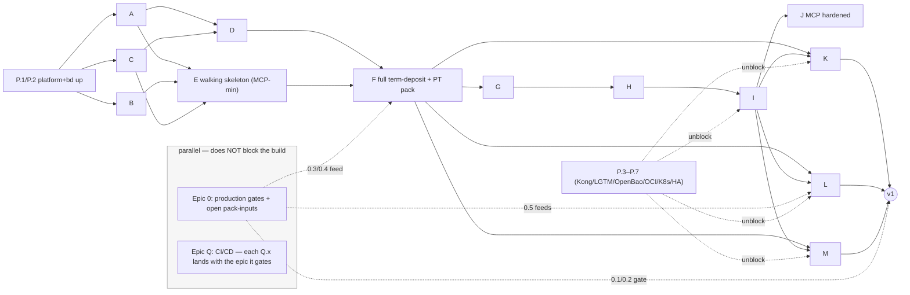

# v1 Build Backlog — Product Engine + Integration Estate

> **Status:** Backlog specification (executable spec for `bd create`). **Not** itself the bd
> backlog — `babelstone` tracks work in bd (dolt db `archie`), and the epics/issues below are
> created locally with `bd create` + `bd dep` in a bd-capable session, then `bd dolt push`.
> This document is the source the creation step reads from.
>
> **Reference convention** (per [product_concepts/README §Cross-references](./README.md)): ADR
> short-forms `[ADR-PC-NNN]` link to [`./adrs/`](./adrs/); design-note short-forms
> (`event-store`, `two-modes`, `surface`, `coexistence`, `authoring`) follow the *Cite as*
> column of [the README map](./README.md); `[Q-XX]` and brief-§ refs point at
> [04 — Open Questions](./04-open-questions.md).

## Context

`babelstone` is moving from a documentation-only reference library into an actual build. The
architecture is **decided**: ADR-PC-000…020 (product engine, [`./adrs/`](./adrs/)) and
ADR-IC-000…013 (integration estate,
[`../integration_concepts/adrs/`](../integration_concepts/adrs/)) are all Accepted, and the
monorepo is scaffolded (bd `archie-bhq.1`: 13 top-level paths, path-scoped CI stubs that
currently `echo TODO`, CODEOWNERS, Dockerfiles). v1 is **execution, not design**.

The existing **`archie-bhq`** epic covers the *governance & build toolchain* — "how we build
safely" (enforcement hooks, fitness functions, spec-coverage checker, ADR-conformance agent,
authoring skills, domain-review agents, plugin). It deliberately does **not** build the
product. This document fills that gap: the bd epics + child issues that build the actual v1
product (*depósito a prazo*) and the in-house estate around it.

### Organizing principle: *production gate ≠ POC prerequisite*

Several decisions that look "open" are in fact **Accepted ADRs whose only residual is a
stakeholder sign-off that blocks production cutover, not the POC build**:

- **Bitemporal mechanism is decided.** [ADR-PC-002](./adrs/ADR-PC-002-application-level-bitemporality.md)
  chose **Path A — application-level bitemporality on plain PostgreSQL**, made *ahead of* the
  [event-store §6.3](./feature-design-event-store-projections.md) spike (because
  [ADR-PC-010](./adrs/ADR-PC-010-dotnet-hand-rolled-engine.md) narrows the candidate set to
  the single-substrate path). It is **Accepted**: Q-Y is "a production gate, not a POC
  prerequisite… For the POC the engine assumes bitemporality is required for all purposes."
  The §6.3 "spike" is reframed by the ADR as a *correctness/performance validation of Path A*
  (the forced-correction round-trip, [ADR-PC-002 §P2](./adrs/ADR-PC-002-application-level-bitemporality.md))
  — Epic D acceptance-test work, **not** a three-way bake-off and **not** a new ADR.
- **DR/RTO/RPO is decided.** [ADR-PC-005](./adrs/ADR-PC-005-dr-rto-rpo.md) is **Accepted** with
  named POC-default targets (RPO ≈ 0 committed / ≤ 60s floor; RTO ≤ 15 min failover / ≤ 4 h
  restore; recovery cold replay ≤ 24 h). "Operating-bank sign-off not required for the POC."
  Implementation is Epic M.4; the sign-off is a cutover gate.

Consequence: **Epic 0 is a parallel production-gate & open-pack-input tracker**, **off the
build critical path**. The critical path is `P.1/P.2 → A/B/C → D → E → F`. No Epic 0 item is
expected to emit a new ADR; if a build genuinely contradicts an Accepted ADR, that is the
**explicit-drift gate** ([ADR-PC-020 §D3](./adrs/ADR-PC-020-llm-toolchain-and-conformance-governance.md):
amend/supersede in the same change), not an Epic 0 spike.

### Decisions carried forward (2026-05-24)

- **Epic axis = hybrid + walking skeleton.** Build the generic engine foundation fully, then a
  thin term-deposit slice end-to-end to de-risk the seams, then thicken.
- **MCP from the start.** A minimal dev MCP ships in the walking skeleton (drive
  constitute/query via MCP); rebuilt/hardened later (Kong-fronted, OAuth 2.1 per
  [ADR-IC-010](../integration_concepts/adrs/ADR-IC-010-mcp-server-runtime-and-sdk.md)). It may
  evolve profoundly.
- **v1 cut = engine + publication + saga + edge + MCP.** **Deferred** to reserved post-v1
  epics: ACL/legacy coexistence, notification/disclosure delivery, IFRS9 signal. The engine
  still *emits* notification + GL events onto the bus; only the rendering/delivery service and
  IFRS9 staging are deferred. Saga legacy-settlement runs against a WireMock stub until the
  ACL epic lands.

### Precision notes

- Pack-effective-date semantics is **brief-level §8** of [04](./04-open-questions.md), **not**
  Q-AH (Q-AH is the *legacy batch file contract*).
- Each fitness-mapped child plugs into the
  [ADR-PC-020 §P10](./adrs/ADR-PC-020-llm-toolchain-and-conformance-governance.md) **spec-first
  loop**: write the named [commitment-catalogue](./adrs/commitment-catalogue.md) Test ID as a
  *failing* test first, implement to green, then flip the catalogue row `Planned → Live` (the
  catalogue is the single place status lives). `BATCH_INGEST_IDEMPOTENT` (PC-017) and
  `IFRS9_POST_FLAG_NEVER_GATES` (PC-015) map onto **deferred** work and stay `Planned` at v1 by
  design (a visible, intentional hole, not a coverage gap).

### Relationship to the existing `archie-bhq` epic

Keep `archie-bhq` as-is; it **interleaves** with these build epics (it can't be fully
satisfied until the code it governs exists). Two non-overlap rules:

- **Epic P (platform) *provisions and runs* the substrate; feature epics only configure it.**
  P stands up the actual Redpanda/PG/Kong/Grafana/OpenBao/OCI processes; I.3 writes Kong
  *routes*, K.4 writes *dashboards*, M.2 wires the *secret boundary*.
- **Epic Q (CI/CD) builds the *authoritative* gates + delivery.** `archie-bhq.2`'s local hooks
  *mirror* these gates (never replace them); `archie-bhq.3/.4/.5` supply the gate *content*;
  Q.7 wires that content into CI as required checks and adds image build/push, signing, and CD.
  Q replaces the `echo TODO` jobs in `.github/workflows/ci.yml`.

---

## Fitness-function map (`archie-bhq.3` seed → build child → Test ID)

Each row binds a load-bearing invariant to the child that realizes it and the
[commitment-catalogue](./adrs/commitment-catalogue.md) Test ID the
[ADR-PC-020 §P6](./adrs/ADR-PC-020-llm-toolchain-and-conformance-governance.md) coverage
checker resolves.

| Commitment | Test ID | Lands with |
|---|---|---|
| append+outbox atomicity ([ADR-PC-001](./adrs/ADR-PC-001-event-store-technology.md) §P2) | `ES_ATOMIC_APPEND_OUTBOX` | **A.2** |
| Money HALF_EVEN boundary + golden corpus ([ADR-PC-010](./adrs/ADR-PC-010-dotnet-hand-rolled-engine.md) §P1–P2) | `MONEY_BOUNDARY_FIXTURES` | **B.1** |
| determinism gate ([ADR-PC-010](./adrs/ADR-PC-010-dotnet-hand-rolled-engine.md) §P5) | `DETERMINISM_GATE` | **A.7** |
| pin-per-event replay ([ADR-PC-009](./adrs/ADR-PC-009-per-instance-version-pinning.md) §P1–P2) | `REPLAY_PIN_PER_EVENT` | **C.7** |
| GL post-flag-never ([ADR-PC-012](./adrs/ADR-PC-012-gl-posting-signal-contract.md) slot 5) | `GL_POST_FLAG_NEVER_GATES` | **G.6** |
| notify post-flag-never ([ADR-PC-025](./adrs/ADR-PC-025-customer-notification-emit-contract.md) slot 5, clean reissue of ADR-PC-014; emit-contract only at v1) | `NOTIFY_POST_FLAG_NEVER_GATES` | **G.6** (emit) / DEF-2 (delivery) |
| cold-replay budgets 5s/30s ([event-store §8.2](./feature-design-event-store-projections.md)) | `REPLAY_BUDGET_5S_30S` | **D.5 / L.3** |
| zero-engine-code-per-variant ([01 §3](./01-product-architecture.md)) | `ZERO_ENGINE_DIFF_PER_VARIANT` | enforced across **E/F** |
| batch-ingest idempotent ([ADR-PC-017](./adrs/ADR-PC-017-legacy-batch-ingest-contract.md) slot 4) | `BATCH_INGEST_IDEMPOTENT` | **DEF-1** (stays `Planned` at v1) |
| IFRS9 post-flag-never ([ADR-PC-015](./adrs/ADR-PC-015-ifrs9-signal-contract.md) slot 5) | `IFRS9_POST_FLAG_NEVER_GATES` | **DEF-3 / v2** (stays `Planned` at v1) |
| constitution-precondition refusal ([ADR-PC-024](./adrs/ADR-PC-024-constitution-precondition-contract.md) slot 5) | `CONSTITUTION_PRECONDITION_REFUSAL` | **F.9** (v1.x) |
| no clock-driven engine signal ([ADR-PC-023](./adrs/ADR-PC-023-temporal-signals-projection-derived.md) slot 1) | `NO_CLOCK_DRIVEN_ENGINE_SIGNAL` | **G.6** (analyser/emit) / DEF-2 (downstream scheduler) |

---

## Epic map (ordered by dependency; leverage-first)

> Working titles only; bd assigns IDs under the repo's `archie-` prefix (dolt db `archie`),
> children `archie-XXX.N`. Tiers indicate build order, not rigid gates.

### Epic 0 — Production gates & open pack-inputs  *(parallel; OFF the build critical path)*

Anchors: [04](./04-open-questions.md); [ADR-PC-002 §Gate](./adrs/ADR-PC-002-application-level-bitemporality.md);
[ADR-PC-005](./adrs/ADR-PC-005-dr-rto-rpo.md); [event-store §6.4](./feature-design-event-store-projections.md).
**Reframed:** none of these block the POC build; they gate production cutover or feed full
pack content (F.7). Track them so cutover readiness is visible, not so the foundation waits.

- **0.1** *(production gate)* Q-Y + §7 DPO/compliance meeting ([event-store §6.4](./feature-design-event-store-projections.md)):
  confirm bitemporal-required and crypto-shredding = Article 17 erasure (Lei 58/2019 +
  retention). The POC proceeds assuming bitemporal-required per
  [ADR-PC-002 §Gate](./adrs/ADR-PC-002-application-level-bitemporality.md); this gate only
  governs *production*. (stakeholder)
- **0.2** *(production gate)* Operating-bank RTO/RPO sign-off on
  [ADR-PC-005](./adrs/ADR-PC-005-dr-rto-rpo.md)'s POC defaults. (stakeholder;
  production-blocking at cutover)
- **0.3** *(open design input → C/F)* Pack-effective-date semantics (**brief §8**):
  pin-at-constitution vs float-per-flow vs per-primitive. Skeleton (E) defaults to
  pin-at-constitution; needed before the **full** PT pack (F.7).
- **0.4** *(open design input → F.7)* v1 regulatory-reporting inventory (**Q-AX**): confirm
  FGD-eligible-balances + BdP rate-statistics + modelo 39 scope for v1.
- **0.5** *(calibration → L)* v4-scale workload calibration (**Q-AK**): the spec and tooling
  are fixed ([ADR-PC-011](./adrs/ADR-PC-011-in-house-load-test-harness.md),
  [two-modes §8](./feature-design-two-modes-asymmetry.md)); residual is operator calibration of
  absolute counts (`N_acct`, `N_card`, `E_year`). Feeds Epic L's absolute thresholds only.
- **0.6** *(open design input → DEF-1, post-v1)* Legacy inventory meeting (brief §1,
  [coexistence §12](./feature-design-strangler-fig-coexistence.md)): which legacy systems get
  first-class adapters. Gates DEF-1, not v1.

### Tier 1 — Platform + generic engine foundation

#### Epic P — Platform & local dev environment  *(substrate; P.1/P.2 precede everything)*

Anchors: ADR-IC-001/002/005/006/007,
[ADR-IC-013](../integration_concepts/adrs/ADR-IC-013-in-house-estate-build-and-repository-placement.md),
`INSTALL.md`, `infra/`.

- **P.1** Local dev stack via **Docker Compose**: PostgreSQL + Redpanda (+ built-in Schema
  Registry) + bootstrap/seed. *(unblocks A, E)*
- **P.2** Toolchain bootstrap: install/pin .NET 10, Go, Python 3.14, CUE, cosign, oras,
  plantuml/graphviz (devcontainer or Makefile; extend `INSTALL.md`). **Includes bd + dolt** (the
  mandated tracker) so backlog ops work in any session.
- **P.3** Add **Kong** (DB-less) + **OpenBao** to the local stack. *(unblocks I, M)*
- **P.4** Add **Grafana LGTM + OTel Collector** to the local stack. *(unblocks K)*
- **P.5** Local **OCI registry** for pack distribution + **EventCatalog** static-site host.
  *(unblocks C.4/C.5, G.4)*
- **P.6** Deployed environments on **Kubernetes**: manifests/Helm per service, namespaces,
  config + OpenBao secret wiring. IaC in `infra/`.
- **P.7** Production-shaped topology: 3-node Redpanda + PG HA (incl. the warm standby
  [ADR-PC-005 §P1](./adrs/ADR-PC-005-dr-rto-rpo.md) requires). *(feeds L load tests, M DR)*

#### Epic A — Event store, outbox & event-sourcing core

Anchors: [ADR-PC-001](./adrs/ADR-PC-001-event-store-technology.md),
[ADR-IC-004](../integration_concepts/adrs/ADR-IC-004-outbox-pattern-mechanism.md),
[ADR-PC-010](./adrs/ADR-PC-010-dotnet-hand-rolled-engine.md),
[ADR-PC-004](./adrs/ADR-PC-004-pii-crypto-shredding.md); [event-store §4/§5/§8](./feature-design-event-store-projections.md).

- **A.1** PostgreSQL append-only `events` table with the full engine envelope (event_id,
  event_type, event_schema_version, instance_id, family, pack_version, schema_version,
  partition_key, valid_time, transaction_time, causation_id, correlation_id, actor, payload).
  Forward-only DDL discipline.
- **A.2** Append + outbox in **one local transaction** (ADR-IC-004) with optimistic concurrency
  on (stream_id, sequence_number). → `ES_ATOMIC_APPEND_OUTBOX`.
- **A.3** Ordered stream load / rehydrate (snapshot + tail).
- **A.4** Snapshot machinery (§8): snapshot table, hash incl. last event_id, per-N / lifecycle /
  calendar triggers, advisory-until-trusted, monthly-discard drill hook.
- **A.5** Field-level PII crypto envelope (§6.2, ADR-PC-004): per-subject key encryption;
  PII/non-PII schema annotation + CI rejection of unannotated string fields; key-destruction =
  erasure.
- **A.6** Handler dispatch runtime (§5): pure `(state,event)→state`, **loaded from family schema
  not engine**, no clock/IO/rng, side-effects-as-scheduled-events.
- **A.7** Determinism CI gate (§5.3, PC-010 §P5): replay-fixture test + Roslyn analysers (ban raw
  decimal rounding outside `Money`; ban clock/IO in handlers). → `DETERMINISM_GATE`.

#### Epic B — Financial-math kernel

Anchors: [financial_concepts](../financial_concepts/banking_products_financial_mathematics.md),
[ADR-PC-010](./adrs/ADR-PC-010-dotnet-hand-rolled-engine.md).

- **B.1** `Money` type: integer cents, HALF_EVEN, golden-corpus boundary tests.
  → `MONEY_BOUNDARY_FIXTURES`.
- **B.2** Day-count primitives: Act/360 (PT default), Act/365, 30/360 — pack-parameterised.
- **B.3** Compounding + accrual: simple, compound, sum-of-daily-balances.
- **B.4** Withholding primitive: flow-by-flow per payment (never rate-scaling), TANB/TANL, 28%
  IRS (2800 bps from pack). *(interlocks `financial-math-reviewer`, `archie-bhq.7`)*
- **B.5** TAE computation: `(1+TAN/m)^m − 1`.
- **B.6** Purity + golden-corpus wiring.

#### Epic C — Config & pack toolchain

Anchors: ADR-PC-006/007/008/009; [surface](./feature-design-configuration-surface.md),
[authoring](./feature-design-configuration-authoring.md).

- **C.1** CUE family-schema language: variant structure, pack-binding decls, type/range bounds;
  no DSL escape hatch.
- **C.2** `pack-validate` Go binary — depths 1–4 (syntactic <1s, type <5s, pack-compliance <10s,
  regulatory-coherence <10s) synchronous at commit.
- **C.3** Depth-5 simulation (<30s) in CI; wire into product-configs/packs CI jobs.
- **C.4** Pack format + signing (PC-007): signed YAML bundle, cosign attestation, OCI push/pull
  by digest, version key `pt.YYYY.N`.
- **C.5** Pack loader/verifier in engine: pull by digest, verify cosign, immutable
  version-keyed in-process cache, fail-loud; all out-of-process work at load time only.
- **C.6** Rate-sheet storage + deploy API (PC-008): separated from configs,
  `rate_sheet_version_id` resolution.
- **C.7** Per-instance pinning (PC-009): pin pack+schema at constitution; PackVersionMigrated /
  SchemaVersionMigrated path; pin-per-event on replay. → `REPLAY_PIN_PER_EVENT`.

#### Epic D — Projection & bitemporal read runtime  *(builds the Accepted ADR-PC-002 Path A)*

Anchors: [event-store §2/§6/§7](./feature-design-event-store-projections.md),
[ADR-IC-005](../integration_concepts/adrs/ADR-IC-005-cqrs-read-model-storage.md),
[ADR-PC-002](./adrs/ADR-PC-002-application-level-bitemporality.md),
[ADR-PC-018](./adrs/ADR-PC-018-channel-routing-coexistence.md). **Not blocked by an Epic 0
spike** — the mechanism is decided (Path A). The build assumes bitemporal-required per
[ADR-PC-002 §Gate](./adrs/ADR-PC-002-application-level-bitemporality.md).

- **D.1** Path-A bitemporal projection storage ([ADR-PC-002 §P1](./adrs/ADR-PC-002-application-level-bitemporality.md)):
  every projection table carries `valid_from`/`valid_to`/`recorded_at`/`superseded_at`;
  structural columns cleartext, PII columns ciphertext (hosts the A.5 envelope).
- **D.2** Projection runtime: log → family projections; per-projection **sync vs async**
  ([two-modes §5.4](./feature-design-two-modes-asymmetry.md)).
- **D.3** Four canonical queries (§2) via the typed helper
  [ADR-PC-002 §P3](./adrs/ADR-PC-002-application-level-bitemporality.md)
  (`AsOf`/`CurrentBelief`/`HistoryOf`): as-of, audit-trail, counterfactual-replay,
  forward-projection.
- **D.4** CQRS read-model surface (IC-005) on same PG; `sor` column reserved (PC-018).
- **D.5** Reconciliation + correctness: **forced-correction round-trip acceptance test**
  ([ADR-PC-002 §P2](./adrs/ADR-PC-002-application-level-bitemporality.md) — corrections
  supersede, never overwrite), daily checksum, event-count, monthly full-rebuild drill (§7);
  cold-replay budget <5s. → `REPLAY_BUDGET_5S_30S`.

### Tier 2 — v1 product content

#### Epic E — Walking skeleton (thin term-deposit slice via MCP)  *(integration milestone)*

Proves every seam end-to-end on the real foundation, driveable by an agent.

- **E.1** Minimal term-deposit family schema: AT_MATURITY only; events DepositConstituted,
  InterestAccrued, WithholdingApplied, DepositMatured; handlers; deposit-position projection.
- **E.2** Minimal PT pack `pt.2026.1-skeleton`: Act/360, irs_juros 2800 bps, simple-interest
  binding; signed + loaded through C.4/C.5. Pins at constitution (Epic 0.3 default).
- **E.3** Constitute→accrue→mature happy path: command → dispatch → handler → kernel →
  append+outbox; legacy settlement **stubbed (WireMock)**.
- **E.4** Publish to Redpanda via outbox relay; Avro schema in `contracts/`; Schema Registry
  registration.
- **E.5** Minimal **dev MCP server** (Python, IC-010): `constitute_deposit`, `get_deposit`, and
  `mature_deposit` tools hitting engine directly (auth deferred; reads are tools per the IC-010
  2026-05-31 amendment). *MCP-from-day-one.*
- **E.6** End-to-end Testcontainers test (PG + Redpanda): constitute via MCP → accrue → mature;
  assert events + projection + published messages. → exercises `ZERO_ENGINE_DIFF_PER_VARIANT`.

#### Epic F — Term-deposit family + PT pack (full v1 content)

Anchors: [02](./02-v1-scope-term-deposits.md),
[surface](./feature-design-configuration-surface.md).

- **F.1** All three interest variants: AT_MATURITY, PERIODIC (`payment_period_months`), ADVANCE.
- **F.2** Full family event set: + DepositConstitutionFailed, InterestPaid, DepositRenewed,
  DepositTerminatedEarly, DepositPartiallyWithdrawn, DepositCorrected, DepositTransferredToHeirs.
- **F.3** Lifecycle state machine: constitution → active → maturity/termination/succession →
  closed.
- **F.4** Early-termination policies: flat + banded (window/penalty pairs, basis, floor).
- **F.5** Auto-renewal: NONE / SAME_TERM_CURRENT_RATE / SAME_TERM_SAME_RATE; 14-day opt-out;
  emit Matured+Constituted+Renewed in order.
- **F.6** Four projections complete: deposit position, accrual schedule, maturity calendar,
  withholding ledger.
- **F.7** Full PT pack `pt.2026.1`: TANB/TANL, TAE, FIN data fields, BdP signals (per Epic 0.4
  inventory), **pack-effective-date semantics per Epic 0.3**.
- **F.8** Sealed v1 test corpus ([surface §3.9](./feature-design-configuration-surface.md)):
  canonical instances (e.g. `pt_dpz_12m_simple_with_irs`) with expected multi-year event
  sequences; wired into CI.
- **F.9** *(v1.x)* Commercial-eligibility preconditions
  ([ADR-PC-024](./adrs/ADR-PC-024-constitution-precondition-contract.md)):
  `required_preconditions` in product config; **decider refusal** on absent/false verdict
  (`DepositConstitutionFailed`); saga gathers verdicts upstream (no in-engine evaluation).
  → `CONSTITUTION_PRECONDITION_REFUSAL`. *(v1 launch products are not eligibility-gated; lands
  with the first gated product.)*
- **F.10** *(v1.x)* Step-up (*crescente*) + amount-tiered (*escalonada*) rate schedules:
  rate-vector resolved at constitution; deterministic fold over the B.3 accrual engine
  (**not** variable/indexed rate — that is v3).
- **F.11** *(v1.x)* Penalty-by-rate-reduction basis on `DepositTerminatedEarly`: recompute at a
  reduced rate, penalty = `J(original) − J(reduced)`; extends F.4 flat/banded.
- **F.12** *(v1.x)* Partial-withdrawal rules: min withdrawal, min remaining balance, *carência*
  lock-up; decider-enforced (the `DepositPartiallyWithdrawn` event ships in F.2).

### Tier 3 — Integration estate (v1 cut)

#### Epic G — Event publication & catalogue

Anchors: ADR-IC-001/002/008/004, ADR-PC-012/014.

- **G.1** Outbox relay hardening: `FOR UPDATE SKIP LOCKED`, Avro publish, publish-lag SLI.
- **G.2** Inbox consumer: dedup by message_id → saga/handler.
- **G.3** Avro contracts + Confluent wire format; Schema Registry BACKWARD/FORWARD/FULL CI gate.
- **G.4** EventCatalog: AsyncAPI import, `npx validate` CI gate, no-event-without-entry
  governance.
- **G.5** Reconciliation contracts per consumer ([event-store §7.3](./feature-design-event-store-projections.md)).
- **G.6** No-PII-on-bus + GL/notify emit-contract post-flag-never fitness tests
  (`contract-reviewer`, `archie-bhq.7`). → `GL_POST_FLAG_NEVER_GATES`,
  `NOTIFY_POST_FLAG_NEVER_GATES` (emit side; delivery deferred DEF-2).

#### Epic H — Saga orchestrator

Anchors: [ADR-IC-003](../integration_concepts/adrs/ADR-IC-003-saga-orchestrator.md),
[integration_concepts §05](../integration_concepts/05-constitution-saga-walkthrough.md).

- **H.1** Saga state machine in PG (ConstitutionProcess:
  STARTED→PARALLEL_VALIDATION→…→COMPLETED / compensation).
- **H.2** Constitution saga: validation, approval, **settlement against WireMock stub**,
  domain-event emission, compensation. (No in-saga client-eligibility/financial-crime
  adjudication — AML/KYC is upstream per [00 §4](./00-product-vision.md); commercial eligibility
  is a precondition per [ADR-PC-024](./adrs/ADR-PC-024-constitution-precondition-contract.md).)
- **H.3** Renewal saga (engine-native): emit Matured+Constituted+Renewed on renewal date.
- ~~**H.4** AML/KYC upstream precondition~~ — **removed 2026-06-03**: AML/KYC is out of scope
  ([00 §4](./00-product-vision.md)); [ADR-PC-013](./adrs/ADR-PC-013-aml-kyc-upstream-precondition.md)
  is `Withdrawn`. Edge enforcement, if any, is an integration-estate concern
  ([ADR-IC-006](../integration_concepts/adrs/ADR-IC-006-edge-api-gateway.md)). (bd `babelstone-jqmu` closed.)
- **H.5** Correlation/causation propagation; OTel span coupling.

#### Epic I — Edge API (Kong) + command/query surface

Anchors: [ADR-IC-006](../integration_concepts/adrs/ADR-IC-006-edge-api-gateway.md),
[ADR-PC-018](./adrs/ADR-PC-018-channel-routing-coexistence.md).

- **I.1** Command API → dispatcher; 202-ACCEPTED + process_id + SSE stream URL.
- **I.2** Query API: as-of / point-in-time reads from read models.
- **I.3** Kong config (DB-less `deck`): JWT, rate-limit, payload validation, OTel plugin, mTLS
  upstream.
- **I.4** PSD2 SCA enforcement at edge (`403 SCA_REQUIRED`). *(AML-clearance enforcement removed 2026-06-03 — AML out of scope, [00 §4](./00-product-vision.md).)*
- **I.5** SoR-routing scaffolding via `sor` column (PC-018); routing in Kong, not engine.

#### Epic J — MCP agent channel (hardened)

Anchors: [ADR-IC-010](../integration_concepts/adrs/ADR-IC-010-mcp-server-runtime-and-sdk.md),
[ADR-IC-011](../integration_concepts/adrs/ADR-IC-011-async-saga-completion-notification.md),
[integration_concepts §11](../integration_concepts/11-chat-agent-channel-strategy.md)/[§10](../integration_concepts/10-security-and-threat-model.md).

- **J.1** Rebuild MCP behind Kong: Streamable HTTP, OAuth 2.1 + RFC 8707 audience binding, IAM
  token reuse.
- **J.2** Full tools (commands) + resources (read models) + prompts (canned workflows).
- **J.3** Async completion: MCP tasks / polling / out-of-band HMAC callback (minimal, since
  notification service deferred).
- **J.4** Human-in-the-loop elicitation (form-mode + URL-mode).
- **J.5** Agent trust-model mitigations (untrusted-but-not-hostile).

### Tier 4 — Cross-cutting / production readiness

#### Epic K — Observability

Anchors: [ADR-IC-007](../integration_concepts/adrs/ADR-IC-007-observability-stack.md),
[integration_concepts §06](../integration_concepts/06-observability-and-tracing.md).

- **K.1** OTel instrumentation (engine + estate): product-semantic spans (accrual computed,
  withholding applied, partition_key).
- **K.2** Grafana LGTM pipeline (Loki/Tempo/Prometheus via OTel Collector).
- **K.3** Critical SLIs: outbox publish-lag, saga states, compensation rate, sync-projection p99,
  replication lag ([ADR-PC-005 §S2](./adrs/ADR-PC-005-dr-rto-rpo.md)).
- **K.4** Per-persona dashboards + correlation_id cross-signal navigation.

#### Epic L — Replay/determinism + v4-scale load harness

Anchors: [ADR-PC-011](./adrs/ADR-PC-011-in-house-load-test-harness.md),
[two-modes §8](./feature-design-two-modes-asymmetry.md), Q-AK.

- **L.1** In-house .NET load harness: drive Redpanda + Kong with the engine's own Avro envelope
  code; seeded RNG + injected clock; measure async-projection latency from OTel.
- **L.2** v4-scale workload (per Epic 0.5 calibration): event mix, peak structure, sync/async
  classification.
- **L.3** Acceptance gates: 250 TPS sustained 24h, 1000 TPS burst 15min, 200ms p99
  sync-projection, replay budgets 5s/30s — **including the sync-replication write-path latency
  cost** [ADR-PC-005 §P1](./adrs/ADR-PC-005-dr-rto-rpo.md) requires the harness to measure.
  → `REPLAY_BUDGET_5S_30S`.
- **L.4** Monthly projection-rebuild drill automation + snapshot-correctness verification.

#### Epic M — Security/GDPR + operational readiness

Anchors: [integration_concepts §10](../integration_concepts/10-security-and-threat-model.md),
[event-store §6.2](./feature-design-event-store-projections.md),
[ADR-PC-004](./adrs/ADR-PC-004-pii-crypto-shredding.md),
[ADR-PC-005](./adrs/ADR-PC-005-dr-rto-rpo.md).

- **M.1** GDPR crypto-shredding erasure end-to-end: PersonalDataErasureRequested → key
  destruction → confirmation; structural fields queryable post-erasure.
- **M.2** OpenBao secret boundary: Core/integration creds outside saga; per-subject keys inside
  engine; rotation. *(honours PII/OpenBao-boundary memory)*
- **M.3** Threat-model mitigations (doc 10): nine trust boundaries, mTLS, RBAC on observability
  PII.
- **M.4** DR/RTO/RPO **implementation** of [ADR-PC-005](./adrs/ADR-PC-005-dr-rto-rpo.md)
  (Accepted): synchronous WAL streaming to warm standby, PITR via pgBackRest/Barman, OpenBao
  key-store DR, recovery drills as DORA evidence (§P5). Numbers are POC defaults pending Epic 0.2
  sign-off.
- **M.5** Reconciliation alerting + ops runbooks (Q-AG): mismatch thresholds, escalation.

#### Epic Q — CI/CD pipeline hardening & delivery  *(spans Tier 1→4; replaces `echo TODO` stubs)*

Anchors: [ADR-PC-019 §P1](./adrs/ADR-PC-019-repository-strategy-monorepo.md),
[ADR-PC-020](./adrs/ADR-PC-020-llm-toolchain-and-conformance-governance.md),
[ADR-IC-009](../integration_concepts/adrs/ADR-IC-009-testing-infrastructure.md),
`.github/workflows/ci.yml`.

- **Q.1** Fill per-service build/test jobs: engine (`dotnet build` + analysers + Testcontainers),
  pack-validate (`go build/test`), mcp-server (python), orchestrator/acl/notification (`dotnet`
  + contract tests), docs (link + PlantUML-render). *(interleaves with each build epic)*
- **Q.2** Contracts CI: Avro/CUE BACKWARD/FORWARD/FULL + EventCatalog `npx validate` (pairs with
  G.3/G.4).
- **Q.3** Pack/rate-sheet CI: validate depths 1–5 + cosign verify + smoke-load (pairs with
  C.2–C.5); rate-sheet schema validation.
- **Q.4** Image build + push to registry from per-service Dockerfiles; SBOM + container scan.
- **Q.5** cosign signing in CI (OIDC keyless) for packs + images; publish pack to OCI by digest.
- **Q.6** CD / deployment pipeline to P.6 environments: promotion, declarative Kong `deck` sync,
  forward-only DB-migration gating.
- **Q.7** Wire fitness-functions + spec-coverage + ADR-conformance as **required checks**
  (interlocks `archie-bhq.3/.4/.5`); the spec-coverage checker asserts every `Live` Test ID
  resolves to a running test.
- **Q.8** Secret scanning + dependency audit (DORA evidence).

### Deferred / reserved (create as `deferred`; post-v1)

- **DEF-1 — ACL + legacy coexistence**
  ([ADR-IC-012](../integration_concepts/adrs/ADR-IC-012-anti-corruption-layer-implementation.md),
  PC-016/017/018): settlement commands, daily batch ingest (`LegacyInstanceObserved`,
  → `BATCH_INGEST_IDEMPOTENT`), reconciliation, unified read surface, SoR routing. **Replaces
  the WireMock settlement stub** from E.3/H.2. Gated by Epic 0.6 (legacy inventory).
- **DEF-2 — Notification & disclosure delivery** (IC-011, PC-014): notification service, HMAC
  webhook delivery, FIN/SECCI/maturity/IRS-statement rendering. (Emit contract lands at v1 in
  G.6.) **Includes the downstream temporal scheduler** that reads the maturity-calendar /
  accrual-schedule projections and drives `SCHEDULED` notifications — the engine emits no
  clock-driven signal ([ADR-PC-023](./adrs/ADR-PC-023-temporal-signals-projection-derived.md) +
  [ADR-PC-014 Amendment A1](./adrs/ADR-PC-014-customer-notification-emit-contract.md)).
- **DEF-3 — IFRS9 signal** (PC-015): raw operational facts (days-past-due,
  restructuring/write-off). Credit-oriented → v2+; `IFRS9_POST_FLAG_NEVER_GATES` built before v2
  credit scope.

---

## Sequencing (Epic 0 is parallel, not on the critical path)

Critical path: **P.1/P.2 → A/B/C → E → F**, with D a parallel branch (`A/C → D → F`).
Foundation A/B/C parallelisable; estate
G/H/I/J after the skeleton proves the seams; K/L/M close v1. Epic 0 and Epic Q run alongside —
Epic 0's items feed pack content (0.3/0.4 → F), load calibration (0.5 → L), and cutover
(0.1/0.2 → v1), but **none of them block A/D**. Later P.x epics unblock I/K/M/L respectively.

> **Refined 2026-05-30 (dependency model → bd).** The original `D → E` edge is superseded.
> The walking skeleton does **not** depend on Epic D — E.1 ships its own *minimal sync*
> deposit-position projection (E.1's defined scope) and E.5's MCP resource reads the engine
> directly, so the full Path-A bitemporal runtime (D.1–D.5) is **Epic-F** work. D and E are
> parallel branches that both feed F. In bd the coarse epic-level edges (`E blocked-by A,B,C,D`)
> were replaced by precise child-level edges — E.1←A.6+B.3, E.2←C.4+C.5, E.3←E.1+E.2+C.6,
> E.4/E.5←E.3 (E.5 also←E.1), E.6←E.3+E.4+E.5 — so `bd ready` now surfaces only E.1 and C.5.
> Recorded as an explicit-drift acknowledgment per
> [ADR-PC-020 §D3](./adrs/ADR-PC-020-llm-toolchain-and-conformance-governance.md).

> **Refined 2026-05-30 (full child-level dependency graph → bd).** Extending the E-decomposition
> above to **every open epic**. The coarse epic-level recipe edges below (`D blocked-by A & C`,
> and the implicit `E→F→G→H→I→J` / `F,I→K,L,M` epic gates) are **superseded** by precise
> child-level edges, and the 13 coarse epic→epic `blocks` edges were **retired and converted to
> non-gating `relates_to`** links — the narrative survives, but scheduling is no longer shadowed
> (an epic-level `blocks` edge propagates to *every* child's readiness, hiding work whose own
> prerequisites are already met). Net in bd: **+67 child-level `blocks` edges** (intra-epic
> ordering + the cross-epic spine — e.g. `F.2→G.3→G.2→H.1→I.1→I.3→I.4→J.1→J.2→J.4→J.5` reproduces
> the estate critical path), one gap-filler `I.3→L.1` (the L.1 load harness drives Kong), and 27
> soft-affinity `relates_to`. The graph is acyclic; `bd ready` now surfaces a **28-task parallel
> frontier** — D, F-content, K, and M fan out as independent tracks while the `G→H→I→J` estate
> spine is the long pole. `D blocked-by A & C` is retired specifically because D's *actual* A/C
> prerequisites (A.1–A.7 event store, C.1 CUE, C.5 loader) are already **closed**, so D's children
> are genuinely ready now. Derivation method: a per-epic analyst pass (one analyst per epic, owning
> edges *into* its epic for no-double-count coverage) → adversarial verification (drop unless a
> real blocker, grounded in this backlog / a description cross-ref / a design-doc §) →
> whole-graph completeness-and-cycle critic → mechanical transitive reduction. Recorded as an
> explicit-drift acknowledgment per
> [ADR-PC-020 §D3](./adrs/ADR-PC-020-llm-toolchain-and-conformance-governance.md).

---

## Creating the backlog (local `bd create`)

bd is the only tracker (per `CLAUDE.md` — not TodoWrite/TaskCreate). New epics inherit the
`archie-` prefix (dolt db `archie`). Dependency edges to record via `bd dep`:

- D blocked-by A & C — *retired 2026-05-30 (coarse epic gate → child-level + `relates_to`); see
  the second note under *Sequencing**
- E blocked-by A, B, C at the **child** level — **not** D (refined 2026-05-30; see the note
  under *Sequencing*): E.1←A.6+B.3, E.2←C.4+C.5, E.3←E.1+E.2+C.6, E.4/E.5←E.3 (E.5 also←E.1),
  E.6←E.3+E.4+E.5
- 0.3 → F.7; 0.4 → F.7; 0.5 → L; DEF-1 blocked-by 0.6
- **0.1 / 0.2 do NOT block A or D** — they block a v1-cutover milestone only.

After creation, expect `bd ready` to surface Tier-1 platform + foundation (A/B/C) with **no
Epic 0 blocker**, deferred epics showing `❄`; then `bd dolt push` + `git push`. If any build
step later contradicts an Accepted ADR, it is **not** an Epic 0 "decision" — invoke the
explicit-drift gate (`amend-adr` / `supersede-adr` skills,
[ADR-PC-020 §D3](./adrs/ADR-PC-020-llm-toolchain-and-conformance-governance.md)) in the same
change.

## v1 done-ness (the gates these issues build toward)

`docker compose up` brings the full local stack healthy (P.1/P.3/P.4); the path-scoped CI runs
*real* build/test/contract jobs (no `echo TODO` left) and CD deploys to a K8s env (Q.1–Q.6,
P.6); walking-skeleton E2E test green (E.6); sealed corpus passes in CI (F.8);
fitness/coverage/conformance wired as required checks (Q.7) with every `Live` Test ID resolving
to a passing test; load-harness acceptance gates met (L.3: 250 TPS/24h, 1000 TPS burst, 200ms
p99, 5s/30s replay incl. sync-replication latency); monthly rebuild drill clean (L.4/D.5);
forced-correction round-trip passes (D.5); GDPR erasure round-trip passes (M.1); DR recovery
drill meets the POC-default budget (M.4).
