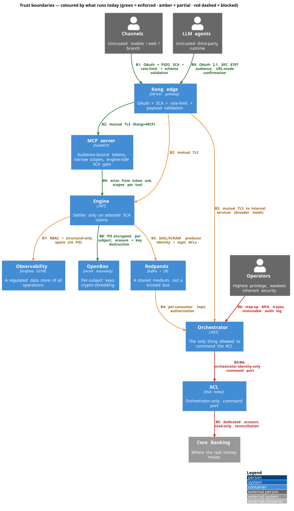

# Security posture — the boundaries, the controls, and what actually runs

**In plain English:** This system moves real money and holds real personal data,
so the interesting security questions are about *boundaries* — every point where
one part of the system has to stop trusting another and check a claim. There are
nine such boundaries. For each one there's a decided control (a gateway check, a
certificate, an encryption key) and an honest status: **some controls run today,
some are partly built, and a couple are blocked because the service they protect
doesn't exist yet.** This page lays all nine out in one place so you — or a
security reviewer who's never seen the repo — can see the whole picture and push
on the weak spots without reverse-engineering it from fifteen decision records.

The deep narrative is [Document 10 — Security and Threat Model](../../docs/product-management/integration_concepts/10-security-and-threat-model.md);
the per-mechanism decisions are [ADR-IC-016](../../docs/product-management/integration_concepts/adrs/ADR-IC-016-service-identity-and-mtls.md)
(service identity), [ADR-IC-006](../../docs/product-management/integration_concepts/adrs/ADR-IC-006-edge-api-gateway.md)
(the edge), [ADR-IC-010](../../docs/product-management/integration_concepts/adrs/ADR-IC-010-mcp-server-runtime-and-sdk.md)
(the agent channel), [ADR-IC-021](../../docs/product-management/integration_concepts/adrs/ADR-IC-021-iam-oauth-authorization-server.md)
(IAM) and [ADR-PC-004](../../docs/product-management/product_concepts/adrs/ADR-PC-004-pii-crypto-shredding.md)
(secrets and PII). This page is the synthesis, not a new decision.

> **Status is a snapshot.** The infra is still being built and will be refactored.
> Trust the *boundaries and mechanisms* as the durable part; re-check the
> Live/Partial/Blocked labels against the code before relying on them.

---

## The picture

Green crossings are enforced today, amber are partly built, **red dashed are
blocked** on a service that doesn't exist yet. The two red lines are the
honest headline: the controls around the real anti-corruption layer and the
operations console can't be finished until those components are built.

---

## The nine boundaries at a glance

A trust boundary is a point where claims must be *verified*, not assumed. This is
the whole posture on one screen; the sections below add detail.

| # | Boundary | The control | Where it lives | Status |
|---|---|---|---|---|
| **B1** | External clients → gateway (incl. the owned-channel Mission Control UI) | OAuth token validation, PSD2 SCA for money ops, rate-limiting, payload validation; the Mission Control demo UI is gated by a Logto OIDC login | [`kong/kong.yml`](../kong/kong.yml); `scripts/edge-contract-test.sh`; `infra/k8s/overlays/staging/mission-control.yaml` | **Live** — edge policies enforced; Mission Control OIDC gate deploy-wired to Logto (staging); full SCA depends on the issuer |
| **B2** | Gateway → internal services | Mutual TLS on every hop; plain HTTP is a config error | `kong/kong.yml` + `mcp-certgen`; [ADR-IC-016 plane (i)](../../docs/product-management/integration_concepts/adrs/ADR-IC-016-service-identity-and-mtls.md) | **Partial** — Kong↔MCP mTLS is live; the engine/orchestrator server-side mTLS trust is code-complete (bd babelstone-zla1.12.25, `InternalMtls`) and a gated staging flip away (`internal-mtls.patch.yaml`); the ACL hop still waits on the real ACL |
| **B3** | Producer → Redpanda | Distinct SASL/SCRAM identity per producer; topic ACLs as config | [`redpanda/topic-acls.yaml`](../redpanda/topic-acls.yaml); `KafkaSaslOptions` | **Partial** — producer-side wiring live; broker-side ACL enforcement planned |
| **B4** | Redpanda → each consumer | Each consumer subscribes only to the topics it needs; data minimization | [`redpanda/topic-acls.yaml`](../redpanda/topic-acls.yaml) | **Planned** — lands per consumer as each consumer service is built |
| **B5** | ACL → Core Banking | Dedicated service account; orchestrator-only command port; read-only reconciliation credential | [ADR-IC-012](../../docs/product-management/integration_concepts/adrs/ADR-IC-012-anti-corruption-layer-implementation.md), [ADR-IC-016](../../docs/product-management/integration_concepts/adrs/ADR-IC-016-service-identity-and-mtls.md) | **Blocked** — the real ACL is not built; the stub stands in |
| **B6** | Ops console → saga / Core | Step-up MFA, 4-eyes over a threshold, immutable audit log | [Document 10 §B6](../../docs/product-management/integration_concepts/10-security-and-threat-model.md) | **Planned** — the operations console is not built yet |
| **B7** | Observability → all data | RBAC by role; structural-only spans (no PII in telemetry) | `infra/grafana/rbac/`; `Babelstone.Telemetry/BabelstoneAttributes.cs` | **Partial** — no-PII spans live; RBAC config landed; end-to-end enforcement test planned |
| **B8** | Personal data vs event immutability | PII encrypted per subject; erasure = key destruction; pseudonymous IDs on the bus | [ADR-PC-004](../../docs/product-management/product_concepts/adrs/ADR-PC-004-pii-crypto-shredding.md); OpenBao | **Partial** — crypto-shredding seam live; the IBAN-in-event case is a named residual |
| **B9** | Agent → MCP server | OAuth 2.1, RFC 8707 audience binding, narrow scopes, URL-mode confirmation, engine-side SCA gate | [`mcp-server/`](../../mcp-server/); `scripts/mcp-contract-test.sh`; `kong/kong.yml` | **Live** — the audience and SCA gates are contract-tested |

---

## The three planes underneath this

[ADR-IC-016](../../docs/product-management/integration_concepts/adrs/ADR-IC-016-service-identity-and-mtls.md)
splits internal security into three planes. It's worth holding these three apart,
because they fail differently:

- **Plane (i) — service-to-service is mutual TLS.** Every internal hop presents an
  X.509 certificate naming its identity, checked before the connection is accepted.
  Certificates come from the OpenBao secret boundary, never from a saga message.
  *Today:* live for Kong↔MCP; the engine/orchestrator server-side mTLS is
  code-complete (bd babelstone-zla1.12.25 — each host pins the internal CA in a
  Kestrel `ClientCertificateValidation` callback) and a gated staging flip away;
  the ACL hop remains blocked on the real ACL having real listening code.
- **Plane (ii) — the event bus is SASL/SCRAM + topic ACLs.** The bus is
  **Redpanda** (Kafka-API-compatible), so these are the Kafka wire protocol's own
  SASL/SCRAM and topic-ACL primitives. Every client that connects to Redpanda logs
  in with its own username; [`topic-acls.yaml`](../redpanda/topic-acls.yaml) says who
  may read or write which topic. A compromised publisher can only reach the topics
  it's granted — it cannot issue commands or touch another context's topics.
  *Today:* producer-side credential wiring is live; broker-side enforcement is
  planned.
- **Plane (iii) — observability is a regulated data store.** Traces and logs are,
  in effect, a searchable index of every operation, so they get RBAC like any data
  store — and, more importantly, **no PII is ever put on a telemetry signal** in
  the first place. Spans carry only structural identifiers and money as integer
  cents; never a name, NIF, IBAN, or account number. *Today:* the no-PII discipline
  is enforced in code; Grafana RBAC config has landed; the end-to-end enforcement
  test waits on a Grafana instance in CI.

---

## The edge and identity

Everything outside the gateway is untrusted. **Kong** is the single front door
([ADR-IC-006](../../docs/product-management/integration_concepts/adrs/ADR-IC-006-edge-api-gateway.md)),
and its entire policy is one declarative file, [`kong/kong.yml`](../kong/kong.yml),
validated in CI. At the edge it: validates the OAuth token, enforces **PSD2 Strong
Customer Authentication** for money operations, rate-limits per identity, validates
the request payload, proxies the long-lived SSE saga streams, and opens mutual TLS
to its upstreams. The engine's *command* surface is deliberately not exposed here —
only its queries and the orchestrator's saga entry point are public routes.

**SCA is not a UI step — it's a saga precondition.** A failed or stale SCA challenge
becomes a first-class `ConstitutionRejected` outcome the saga compensates, not a
technical error. For agent-driven money moves the engine itself refuses to settle
without fresh `acr`/`auth_time` claims attested by the gateway, so an agent can't
fabricate authentication.

The token issuer is **Logto** ([ADR-IC-021](../../docs/product-management/integration_concepts/adrs/ADR-IC-021-iam-oauth-authorization-server.md)),
chosen largely because it natively does RFC 8707 audience binding — a hard
requirement for the MCP channel. It's wired in the **staging** overlay; the dev
stacks use test-fixture tokens.

**The Mission Control demo UI is an owned channel, and it is now gated (B1).** On the public staging
box, `app.babelstone.dev` used to be an *unauthenticated* surface. It now runs with
`MC_AUTH_MODE=oidc` — a Logto OIDC login gate (auth-code + PKCE S256) in front of every route
([ADR-IC-021](../../docs/product-management/integration_concepts/adrs/ADR-IC-021-iam-oauth-authorization-server.md)
rollout step 2, the owned-channel Boundary 1). The gate is a confidential client: its client secret
and its own session-signing key are OpenBao-seeded into `babelstone-dev-secrets` and injected at
deploy, never committed. Because Logto advertises its **public** endpoints in discovery, Mission
Control's login backchannel dials `https://auth.babelstone.dev` (a hairpin out through Traefik) — the
same path Grafana's operator SSO uses — so no new internal network rule is introduced. The Logto
application itself is hand-registered (DCR is the accepted §C6 gap) per
[`infra/runbooks/mission-control-oidc-registration.md`](../runbooks/mission-control-oidc-registration.md).

---

## The agent channel (the least controllable boundary)

The MCP server fronts the bank for LLM agents the bank can't trust or patch
([ADR-IC-010](../../docs/product-management/integration_concepts/adrs/ADR-IC-010-mcp-server-runtime-and-sdk.md),
[Document 11](../../docs/product-management/integration_concepts/11-chat-agent-channel-strategy.md)).
The defences assume the agent is well-meaning but manipulable:

- **OAuth 2.1 on every request**, with **RFC 8707 audience binding** — a token
  minted for another MCP server is rejected before app code runs.
- **Narrow, per-tool-family scopes** (`deposits:read`, `deposits:write`, …) — no
  god-scope.
- **The actor is the token's `sub`**, never a tool argument — an agent can't claim
  to be someone else.
- **Irreversible operations remove the agent from the confirmation path** via
  URL-mode confirmation: the customer authenticates in a bank-controlled context and
  the saga reads the result directly. The agent observes the outcome; it never sees
  the SCA factors.
- **Free-text is treated as data, not instructions** — capped and sanitized at the
  engine boundary to narrow prompt-injection.

These are exercised by `scripts/mcp-contract-test.sh`, which is why B9 is one of the
green crossings.

---

## Secrets and data protection

- **Secrets live in OpenBao, never in config or on the bus.** Credentials and
  encryption keys are resolved at service start-up; they never appear in a log, a
  span, a saga message, or a Redpanda record.
- **PII is crypto-shredded** ([ADR-PC-004](../../docs/product-management/product_concepts/adrs/ADR-PC-004-pii-crypto-shredding.md)).
  Each data subject gets an OpenBao transit key; a PII field is encrypted with it
  *before* it enters an event. GDPR erasure = destroying that key, after which
  replay yields null in the PII fields while the structural audit trail stays
  intact. Even the erasure event carries a salted one-way pseudonym, not the raw id.
- **Personal data belongs in the Customer Data Store, not in events.** Events carry
  only the pseudonymous `client_id`. The honest exception is the **IBAN in
  `DepositConstituted`** — financial account data that currently persists in the
  log. It's the named residual risk on B8: minimize by consumer authorization until
  consumers can resolve it from the Customer Data Store instead.

---

## Regulatory mapping (Portuguese banking)

The boundaries above exist partly because the regulators require them. The short
version ([Document 10 §Regulatory Obligations](../../docs/product-management/integration_concepts/10-security-and-threat-model.md)):

| Framework | What it forces | Where it shows up here |
|---|---|---|
| **PSD2** | Strong Customer Authentication for payments | SCA as a saga precondition (B1, B9); the engine-side SCA gate |
| **GDPR** | Right to erasure, data minimization, EU residency | Crypto-shredding + Customer Data Store (B8); no PII on the bus or in telemetry (B4, B7) |
| **Banco de Portugal / FGD** | Tamper-evident audit trail; reconciled read models | Append-only event log + saga state; periodic reconciliation |
| **DORA** | Incident response, resilience testing, third-party risk | The ACL's indeterminate-state handling + reconciliation as the Core-Banking resilience control |

---

## The honest summary for a reviewer

If you're here to critique, start with the two **blocked** boundaries and the
**partial** ones:

- **B5 / B6 are blocked, and they're the highest-privilege boundaries.** The
  control that stops a compromised internal service from issuing real debits (the
  orchestrator-only ACL command port) and the controls around the operations
  console both depend on services that aren't built yet. The mechanism is decided;
  the enforcement isn't there. This is the single most important thing to know.
- **B2, B3, B4, B7 are partial.** The decisions and the producer/config side exist;
  the enforcement legs (internal mesh mTLS, broker-side Redpanda topic ACLs, the Grafana RBAC
  enforcement test) land as the surrounding services do.
- **B8's residual is the IBAN-in-event case** — worth a hard look from a GDPR angle.
- **B1 and B9 are the most complete** — the edge and the agent channel both have
  contract tests guarding them.

---

## Where to go next

- The topology these boundaries sit on: [`topology.md`](./topology.md).
- The full threat model and the six security principles: [Document 10](../../docs/product-management/integration_concepts/10-security-and-threat-model.md).
- The mechanism decisions: [ADR-IC-016](../../docs/product-management/integration_concepts/adrs/ADR-IC-016-service-identity-and-mtls.md),
  [ADR-IC-006](../../docs/product-management/integration_concepts/adrs/ADR-IC-006-edge-api-gateway.md),
  [ADR-IC-010](../../docs/product-management/integration_concepts/adrs/ADR-IC-010-mcp-server-runtime-and-sdk.md),
  [ADR-PC-004](../../docs/product-management/product_concepts/adrs/ADR-PC-004-pii-crypto-shredding.md).
