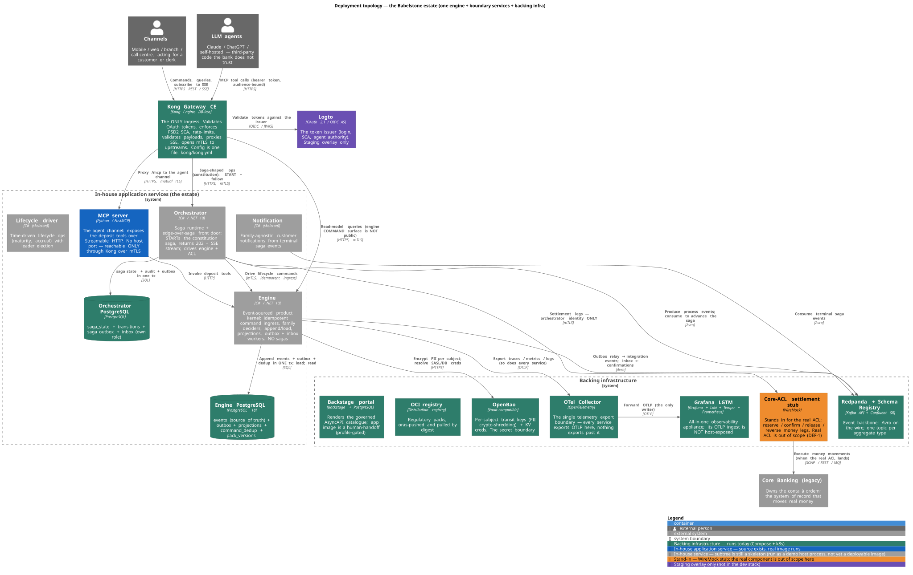

# Deployment topology — what runs, and how it fits together

**In plain English:** Babelstone is one small product engine surrounded by a ring
of supporting services — a database, an event bus, an API gateway, a secrets
store, an observability stack — plus a few boundary services that talk to the
outside world. Everything that faces the network goes through **one front door**
(the Kong gateway); everything inside talks to its neighbours over named,
authenticated channels. This page is the map: the boxes, the wires between them,
and which boxes are real today versus still a placeholder.

If you only read one thing, read the diagram and the **Service inventory** table
below. The rest expands each part.

> This is the *orientation* layer. The authoritative detail lives in the files it
> links to — [`infra/README.md`](../README.md) (the dev stack), [`infra/k8s/README.md`](../k8s/README.md)
> (the deployed stack), and the ADRs. Because the infra is still moving, treat the
> **status labels here as a snapshot**, not a contract.

---

## The picture

Read it top-to-bottom: untrusted callers on top, the gateway as the only way in,
the in-house application services in the middle, and the backing infrastructure
they depend on at the bottom. Colours mark **what actually runs**: green services
are real and running, blue services have real images, grey ones are still
skeletons run as demo processes, amber is a stand-in stub, purple is staging-only.

---

## Service inventory

The same stack is described in detail in [`infra/README.md`](../README.md); this
is the at-a-glance version.

### In-house application services (the estate)

| Service | What it is | Language | Status today |
|---|---|---|---|
| **Engine** | Event-sourced product kernel — appends events, runs family deciders, serves queries, relays the outbox. The source of truth. | C# / .NET 10 | Skeleton subtree; runs as a demo host process, not yet a deployable image |
| **Orchestrator** | Runs the constitution **saga** and is the edge-over-saga front door (accepts the request, returns a status stream). | C# / .NET 10 | Skeleton subtree; runs as a demo host process |
| **MCP server** | The agent channel — exposes the deposit tools to LLM agents over Streamable HTTP. **No host port; reachable only through Kong over mutual TLS.** | Python / FastMCP | Real image, runs in the dev stack |
| **Families** | Product-family logic (term deposit, loans). Not a separate process — compiled into the engine and orchestrator. | C# | Library |
| **Notification** | Family-agnostic customer notifications from terminal saga events. | C# | Skeleton |
| **Lifecycle driver** | Time-driven lifecycle operations (maturity, accrual) with leader election. | C# | Skeleton |

### Backing infrastructure (runs today, in Compose and k8s)

| Service | Role | Host port (dev) | ADR |
|---|---|---|---|
| **PostgreSQL** | The event store — events, outbox, projections. The source of truth. | `5432` | [ADR-PC-001](../../docs/product-management/product_concepts/adrs/ADR-PC-001-event-store-technology.md) |
| **Redpanda + Schema Registry** | Kafka-compatible event backbone; Avro on the wire; one topic per `aggregate_type`. | `19092` / `18081` | [ADR-IC-001](../../docs/product-management/integration_concepts/adrs/ADR-IC-001-event-backbone-message-broker.md), [ADR-IC-002](../../docs/product-management/integration_concepts/adrs/ADR-IC-002-schema-format-and-registry.md) |
| **Kong Gateway CE** | The edge — the single ingress. Auth, SCA, rate-limit, payload validation, mTLS to upstreams. Config is one file. | `8000` / `8001` | [ADR-IC-006](../../docs/product-management/integration_concepts/adrs/ADR-IC-006-edge-api-gateway.md) |
| **OpenBao** | The secret boundary — per-subject encryption keys (crypto-shredding) and credentials. | `8200` | [ADR-PC-004](../../docs/product-management/product_concepts/adrs/ADR-PC-004-pii-crypto-shredding.md) |
| **OTel Collector** | The single telemetry export boundary — every service exports here, nothing exports past it. | `4317` / `4318` | [ADR-IC-007](../../docs/product-management/integration_concepts/adrs/ADR-IC-007-observability-stack.md) |
| **Grafana LGTM** | All-in-one observability appliance (Grafana + Loki + Tempo + Prometheus). | `3000` | [ADR-IC-007](../../docs/product-management/integration_concepts/adrs/ADR-IC-007-observability-stack.md) |
| **OCI registry** | Distribution registry for regulatory packs (pushed and pulled by digest). | `5001` | [ADR-PC-007](../../docs/product-management/product_concepts/adrs/ADR-PC-007-signed-yaml-oci-pack.md) |
| **Backstage portal** | Renders the governed AsyncAPI catalogue. App image is a human-handoff; profile-gated off by default. | `7007` | [ADR-IC-015](../../docs/product-management/integration_concepts/adrs/ADR-IC-015-event-catalog-governance-tooling-backstage.md) |
| **Core-ACL settlement stub** | A WireMock stand-in for the real anti-corruption layer's money legs (reserve / confirm / release / reverse). | `8089` | [ADR-PC-016](../../docs/product-management/product_concepts/adrs/ADR-PC-016-legacy-current-account-adapter.md) |

### Outside the boundary

- **Channels** — mobile / web / branch / call-centre, acting for a customer or clerk.
- **LLM agents** — Claude / ChatGPT / self-hosted clients the bank does **not** trust.
- **Core Banking (legacy)** — the system of record that moves real money, reached only through the ACL.
- **Logto** — the OAuth 2.1 / OIDC token issuer ([ADR-IC-021](../../docs/product-management/integration_concepts/adrs/ADR-IC-021-iam-oauth-authorization-server.md)). Wired in the **staging** overlay only.

---

## How a request flows

There are three paths in, and they share one gateway.

1. **The saga path (constitution).** A channel calls `POST /api/v1/deposits/constitute`
   through Kong, which routes it to the **orchestrator**. The orchestrator starts
   the constitution saga, immediately returns `202 Accepted` with a `process_id`
   and an SSE stream URL, then drives the steps: it tells the **engine** to append
   the deposit and calls the **ACL** for the money legs (reserve → confirm, with
   compensations if anything refuses). The channel follows progress on the SSE
   stream (`GET /api/v1/processes/{id}/stream`).

2. **The agent path.** An LLM agent calls the MCP tools at `/mcp` through Kong.
   Kong validates the token and opens mutual TLS to the **MCP server**, which
   invokes the matching engine operation. The MCP server has **no host port** — an
   agent cannot reach it except through the gateway, so the audience check and
   scope enforcement always apply.

3. **The query path.** Read-model queries (`GET /v1/deposits/{id}`,
   `/v1/deposits/maturities`) go through Kong to the **engine**'s query surface.
   Note the asymmetry: the engine's *command* surface (`POST /v1/deposits`) is
   **deliberately not a public route** — only the orchestrator reaches it, over
   internal mTLS.

### The event backbone

The engine and orchestrator don't call every downstream directly — they publish
events to **Redpanda** and let consumers subscribe. The engine writes events and
its **outbox** in one database transaction, then a relay worker publishes them to
Redpanda (the outbox pattern, [ADR-IC-004](../../docs/product-management/integration_concepts/adrs/ADR-IC-004-outbox-pattern-mechanism.md)).
Who may produce or consume which topic is not a convention — it's declared in
[`infra/redpanda/topic-acls.yaml`](../redpanda/topic-acls.yaml) and enforced by the
broker. Topics are named after the `aggregate_type` (e.g. `term_deposit`) plus the
logical `deposits.integration.events` / `deposits.process.events` domain topics.

### Two cross-cutting seams

- **Observability.** Every service exports OTLP to the **OTel Collector** and to
  nothing else; the Collector is the only thing that writes to Grafana LGTM. That
  single-export rule is the point — it's the one place sampling and PII redaction
  are applied. ([ADR-IC-007](../../docs/product-management/integration_concepts/adrs/ADR-IC-007-observability-stack.md))
- **Secrets.** Encryption keys and credentials come from **OpenBao**, resolved at
  service start-up. Secrets never ride a saga message or the event bus.
  ([ADR-PC-004](../../docs/product-management/product_concepts/adrs/ADR-PC-004-pii-crypto-shredding.md))

---

## The four deployment shapes

The *same* set of services is packaged four ways. The dev Compose stack and the
k8s `dev` overlay are for working on a laptop; `ha` and `staging` are the
deployed shapes. Crucially, the Kong and OTel-Collector configs are **one source
of truth** ([`kong/kong.yml`](../kong/kong.yml), [`otel/collector.yaml`](../otel/collector.yaml))
— the k8s ConfigMaps are generated from the same files Compose mounts, so a config
change updates every shape at once.

| Concern | Compose (`infra/compose.yaml`) | k8s `dev` | k8s `ha` | k8s `staging` |
|---|---|---|---|---|
| Purpose | Laptop walking skeleton | Single-env cluster test | Production-shaped HA | Always-on public demo box |
| Where | Docker on your machine | Any cluster | Any cluster | Single-node k3s (Hetzner) |
| Postgres | 1 node | 1 node | **Primary + synchronous off-site standby** (RPO ≈ 0) | 1 node, durable volume |
| Redpanda | 1 node (dev-container) | 1 node | **3-node Raft quorum** | 1 node |
| Public access | host ports | `port-forward` | `port-forward` | **Public Traefik ingress + TLS** |
| Token issuer | none (tokens are test fixtures) | none | none | **Logto** (`auth.babelstone.dev`) |
| Exposure | everything on localhost | ClusterIP | ClusterIP | only Kong, Backstage, the demo UI, and Logto are public — never OTLP |

The deep detail for the deployed shapes is in [`infra/k8s/README.md`](../k8s/README.md);
the dev stack's scope boundaries are in [`infra/README.md`](../README.md).

---

## Bring-up ordering

The dependency chain matters because some services refuse to start until the
ones they need are healthy:

1. `make up` starts the **backing infrastructure** and waits until every health
   check is green. Within that, Kong waits for the MCP server's TLS listener, the
   MCP server waits for its one-shot cert generator, and the Collector waits for
   Grafana.
2. A host then applies the **event-store migrations** to Postgres. The engine does
   *not* migrate the event store on boot — the demo scripts do it first. (Without
   this the engine boots against a half-empty database.)
3. The **demo scripts** start the application services as needed
   (`make demo-mcp`, `demo-saga`, `demo-agent`, or `demo` for the whole backend).

See the [root `Makefile`](../../Makefile) and `scripts/demo-*.sh` for the exact
sequence.

---

## What's real vs a placeholder

Being honest about this is the whole point — a reviewer needs to know what they're
looking at:

- **Real and running:** all backing infrastructure (Postgres, Redpanda, Kong,
  OpenBao, OTel, Grafana, registry), the MCP server, and the ACL **stub**.
- **Skeleton (runs as a demo host process, no deployable image yet):** engine,
  orchestrator, notification, lifecycle driver.
- **Stand-in:** the Core-ACL settlement **stub** is WireMock; the real ACL is out
  of scope. Core Banking itself is external and not part of this repo.
- **Staging-only:** Logto, the public TLS ingress, durable storage.
- **Human-handoff:** the Backstage portal needs an app image built before it runs;
  until then the catalogue is served Git-natively.

---

## Where to go next

- The security side of this same topology: [`security-posture.md`](./security-posture.md).
- The dev stack, endpoint by endpoint: [`infra/README.md`](../README.md).
- The deployed stack and overlays: [`infra/k8s/README.md`](../k8s/README.md).
- The architecture narrative behind these choices: the
  [integration_concepts series](../../docs/product-management/integration_concepts/),
  documents 00–11.
